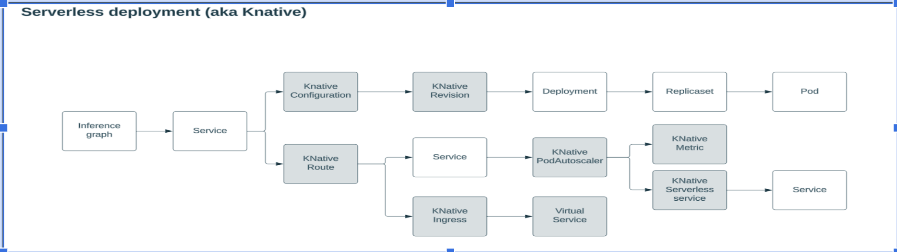
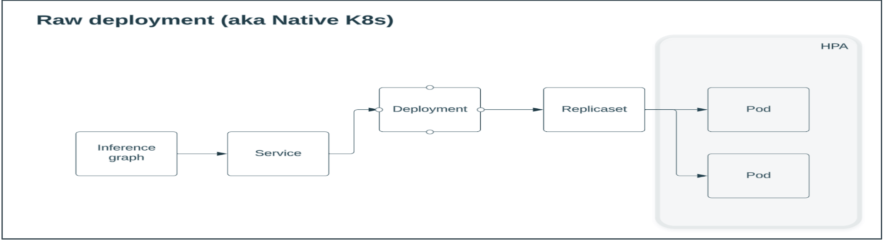

# Announcing: KServe vx.xx

We are excited to announce the release of KServe x.xx, in this release we made enhancements to the KServe control plane, especially brining RawDeployment for `InferenceGraph` as well.  Previously `RawDeployment` existed only for `InferenceService` 

Here is a summary of the key changes:

## KServe Core Inference Enhancements

- Inference Graph enhancements for supporting `RawDeployment` along with Auto Scaling configuration right within the `InferenceGraphSpec` 

IG `RawDeployment` makes the deployment light weight using native k8s resources. See the comparison below





AutoScaling configuration fields were introduced to support scaling needs in 
`RawDeployment` mode.  These fields are optional and when added effective only when this annotation `serving.kserve.io/autoscalerClass` not pointing to `external`
 see the following example with Auto scaling fields `MinReplicas`, `MaxReplicas`, `ScaleTarget` and `ScaleMetric`:
  
  ```yaml
    apiVersion: serving.kserve.io/v1alpha1
    kind: InferenceGraph
    metadata:
      name: graph_with_switch_node
      annotations:
        serving.kserve.io/deploymentMode: "RawDeployment"
    spec:
      nodes:
        root:
          routerType: Sequence
          steps:
            - name: "rootStep1"
              nodeName: node1
              dependency: Hard
            - name: "rootStep2"
              serviceName: {{ success_200_isvc_id }}
        node1:
          routerType: Switch
          steps:
            - name: "node1Step1"
              serviceName: {{ error_404_isvc_id }}
              condition: "[@this].#(decision_picker==ERROR)"
              dependency: Hard
      MinReplicas: 5
      MaxReplicas: 10
      ScaleTarget: 50
      ScaleMetric: "cpu"
  ```
  For more details please refer to the [issue](https://github.com/kserve/kserve/issues/2454).

- 

### Enhanced Python SDK Dependency Management

- 
- 

### KServe Python Runtimes Improvements
- 

### LLM Runtimes

#### TorchServe LLM Runtime

#### vLLM Runtime

## ModelMesh Updates

### Storing Models on Kubernetes Persistent Volumes (PVC)

### Horizontal Pod Autoscaling (HPA)

### Model Metrics, Metrics Dashboard, Payload Event Logging

## What's Changed? :warning:

## Join the community

- Visit our [Website](https://kserve.github.io/website/) or [GitHub](https://github.com/kserve)
- Join the Slack ([#kserve](https://kubeflow.slack.com/?redir=%2Farchives%2FCH6E58LNP))
- Attend our community meeting by subscribing to the [KServe calendar](https://wiki.lfaidata.foundation/display/kserve/calendars).
- View our [community github repository](https://github.com/kserve/community) to learn how to make contributions. We are excited to work with you to make KServe better and promote its adoption!


Thanks for all the contributors who have made the commits to 0.11 release!

The KServe Working Group
