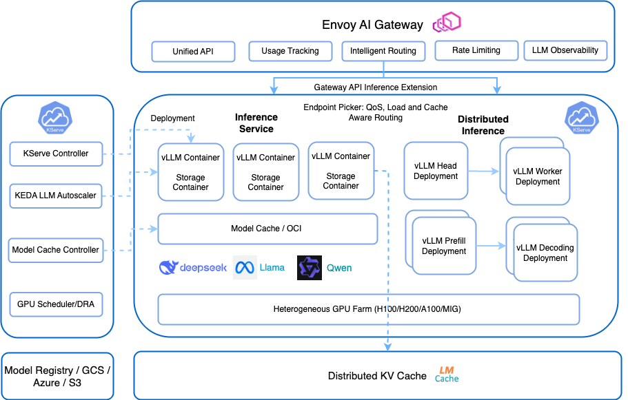

# Announcing: KServe v0.15： Advancing Generative AI Model Serving

Authors: Alexa Griffith, Dan Sun, Yuan Tang, Johnu George, Lize Cai

We are thrilled to announce the release of **KServe v0.15**, marking a significant leap forward in serving both predictive and generative AI models. This release introduces enhanced support for generative AI workloads, including advanced features for serving large language models (LLMs), improved model and KV caching mechanisms, and integration with Envoy AI Gateway.

---

## Embracing Generative AI Workloads

KServe v0.15 brings first-class support for generative AI workloads, marking a key evolution beyond traditional predictive AI. Unlike predictive models that infer outcomes from existing data, generative models like large language models (LLMs) create new content from prompts. This fundamental difference introduces new serving challenges. KServe now provides the infrastructure and optimizations needed to serve these models efficiently at scale.

To support these workloads, we've introduced a dedicated **Generative AI** section in our documentation, detailing the new capabilities and configurations tailored for generative models.

KServe now offers a **lightweight** installation for hosting LLMs on Kubernetes, please follow [generative inference installation guide](https://kserve.github.io/website/0.15/admin/kubernetes_deployment) to get started. KEDA is an optional component for scaling based on LLM specific metrics and Envoy AI gateway is optional for advanced traffic management capacbilities with token rate limiting, unified API and intelligent routing.  

---

## Key Generative AI Features in v0.15

- **Envoy AI Gateway Integration**
- **Multi Node Inference**
- **LLM Autoscaler with KEDA**
- **Distributed KV Cache with LMCache**

---

### Envoy AI Gateway Support

KServe v0.15 adds early support for [**Envoy AI Gateway**](https://aigateway.envoyproxy.io), a CNCF open source project built on top of [Envoy Gateway](https://gateway.envoyproxy.io) and designed specifically for managing generative AI traffic.

[Envoy Gateway](https://gateway.envoyproxy.io) is also now supported in KServe along with [Kubernetes Gateway API](https://gateway-api.sigs.k8s.io). Unlike traditional gateway solutions, Envoy AI Gateway provides advanced capabilities tailored to AI serving, including:

- Dynamic model routing based on request content, model metadata, or user context.
- Built-in support for multi-tenant inference, with fine-grained access controls and authentication.
- Unified API for routing and managing LLM/AI traffic easily.
- Integrated observability for model-level performance insights.
- Extensibility for inference-specific policies like rate-limiting by token, and model lifecycle management.
- Automatic failover mechanisms to ensure service reliability.

This integration enables a unified, intelligent entrypoint for both predictive and generative workloads—scaling from traditional models to complex LLMs—all while abstracting infrastructure complexity from the user. Please refer to [Envoy AI Gateway integration doc](https://kserve.github.io/website/0.15/admin/ai-gateway_integration) for more details.

---

### Multi-Node Inference

KServe has implemented an initial version of multi-node, multi-GPU inference when your model is too large to fit in a single node such as Llama 3.1 405B. As models continue to grow, multi-nide inference capabilities are increasingly important for production deployments that require real-time user experience. Please refer to the [Multi Node inference doc](https://kserve.github.io/website/0.15/modelserving/v1beta1/llm/huggingface/multi-node) for more details.

The community is also working on a [new distributed inference API](https://github.com/kserve/kserve/issues/4433) to allow scaling Multi Node Inference and support Disaggregatd Prefilling which is targeted for large LLM deployments. 

---

### LLM Autoscaler with KEDA

KServe now integrates with **KEDA** (Kubernetes Event-Driven Autoscaling) which is an optional component, enabling advanced scaling strategies:

- Scale based on custom metrics such as KV cache utilization or token throughput.

This empowers users to efficiently manage LLM workloads that can scale dynamically based on custom metrics, please follow the [doc](https://kserve.github.io/website/0.15/modelserving/autoscaling/keda/autoscaling_llm) for how to autoscale based on vLLM metrics.

---

### Distributed KV Cache with LMCache

Key-Value (KV) cache offloading is a technique used in large language model (LLM) serving to store and reuse the intermediate key and value tensors generated during model inference. In transformer-based models, these KV caches represent the context for each token processed, and reusing them allows the model to avoid redundant computations for repeated or similar prompts.

By enabling KV cache offloading across multiple requests and serving instances, you can achieve reduced TTFT, improved scalablity for shared cache across replicas and improved user experience for multi-turn QA or RAG.

Please follow the [doc](https://kserve.github.io/website/0.15/modelserving/v1beta1/llm/huggingface/kv_cache_offloading/#overview) to optimize your GenAI inference workload.

---

### Advanced Model Caching Mechanisms

To address the challenges of serving large models, KServe v0.15 introduces advanced model caching features:

- **LocalModelCache Enhancements:** Improved the LocalModelCache custom resource to support multiple node groups, providing greater flexibility in model placement and caching strategies.
- **Node Agent Improvements:** Enhanced the local model node agent for better performance and reliability.

These enhancements reduce model loading times and improve the overall efficiency of serving large models.

---

### Enhanced vLLM Backend Support

The vLLM backend has been significantly upgraded to better serve generative AI models:

- **Version Upgrade:** Updated to vLLM 0.8.5, bringing performance improvements with v1 backend and new features.
- **Qwen3 & Llama4:** Added support for Qwen3 and Llama4 model.
- **Reranking Support:** Added support for reranking models.
- **Embedding Support:** Added support for OpenAI-compatible embeddings API, enabling a broader range of applications.

---

## Additional Improvements

This release also includes several other enhancements:

- Support Deep Health Checks [#3348](https://github.com/kserve/kserve/pull/3348)
- Collocated Transformer & Predictor Feature [#4255](https://github.com/kserve/kserve/pull/4255)
- Kubernetes Gateway API support [#3952](https://github.com/kserve/kserve/pull/3952)
- Security Updates

For a complete list of changes and updates, please refer to the official release notes.

---

## Join the Community

We invite you to explore the new features in KServe v0.15 and contribute to the ongoing development of the project:

- Visit [KServe Website](https://kserve.github.io/website/master/)
- Explore [KServe GitHub Repository](https://github.com/kserve/kserve)
- Join the conversation on CNCF Slack (#kserve)
- Attend our community meetings by subscribing to the [KServe calendar](https://zoom-lfx.platform.linuxfoundation.org/meetings/kserve?view=month)

We extend our gratitude to all the contributors who made this release possible. Your efforts continue to drive the advancement of KServe as a leading platform for serving machine learning models.

**Happy serving!**