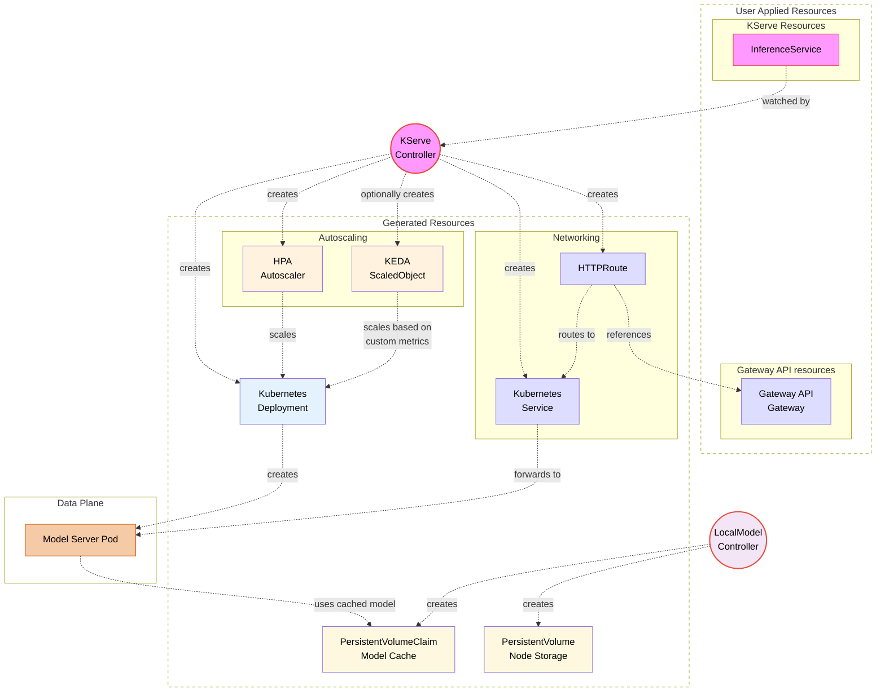
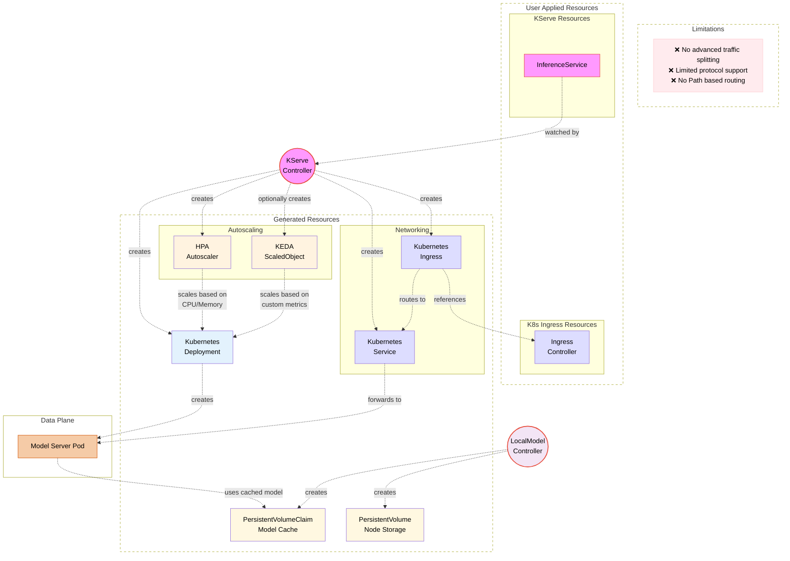
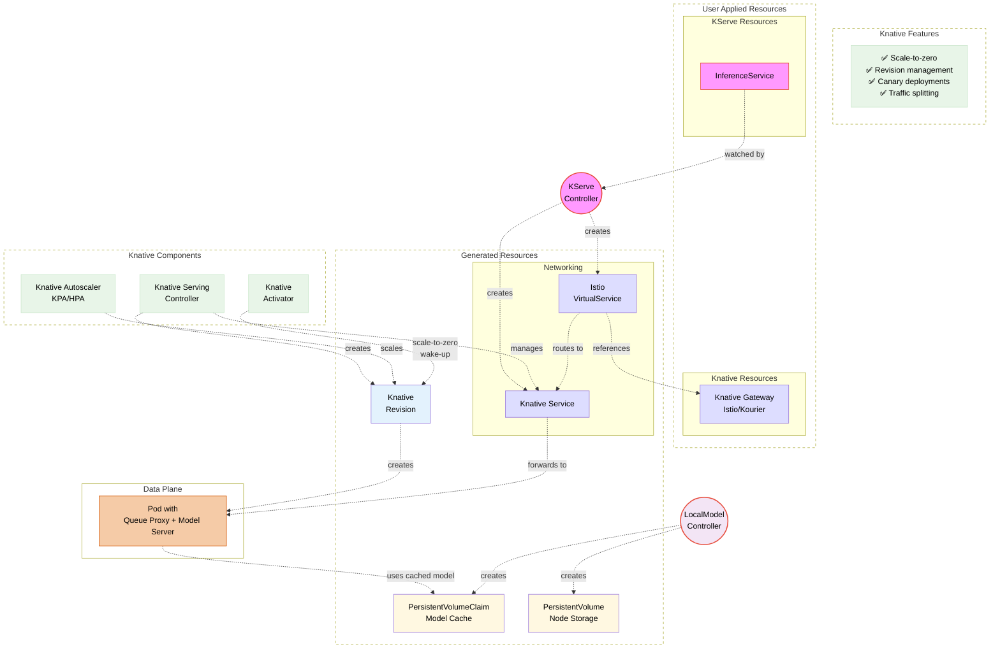

# Control Plane

The KServe control plane is responsible for managing the lifecycle of inference services, coordinating with Kubernetes APIs, handling resource orchestration, and providing autoscaling capabilities. It serves as the brain of the KServe platform, ensuring that model serving workloads are properly deployed, monitored, and scaled according to demand.

## Overview

The control plane operates independently from the data plane, allowing for clean separation of concerns and improved system reliability. It handles all management operations while the data plane focuses purely on inference execution. The control plane supports two distinct deployment modes, each with different architectural patterns and capabilities.

## Architecture Diagrams

### Standard Deployment Mode with Gateway API (Recommended)


### Standard Deployment Mode with Kubernetes Ingress (Limited Functionality)



### Knative Mode with Knative



### LLM Model Caching Architecture

```mermaid
graph TB
    %% Define styles for different component categories
    classDef localModelControllerStyle fill:#f3e5f5,stroke:#E74C3C,color:#000,stroke-width:2px
    classDef localResourceStyle fill:#f9f,stroke:#E74C3C,color:#000
    classDef generatedResourceStyle fill:#ddf,stroke:#none,color:#000
    classDef storageBackendStyle fill:#e3f2fd,stroke:#none,color:#000
    classDef modelCacheStyle fill:#fff3e0,stroke:#none,color:#000
    classDef nodeResourceStyle fill:#fff8e1,stroke:#none,color:#000
    classDef agentStyle fill:#e8f5e8,stroke:#c8e6c9,color:#000

    subgraph "UserAppliedResources"["User Applied Resources"]
        LMCache[LocalModelCache]:::localResourceStyle
        LMNG[LocalModelNodeGroup]:::localResourceStyle
        LMCache -.->|references| LMNG
    end
    style UserAppliedResources fill:none,stroke-dasharray:5
    
    LController((LocalModel<br/>Controller)):::localModelControllerStyle
    
    subgraph "GeneratedResources"["Generated Resources"]
        LMN_A[LocalModelNode<br/>Node A]:::generatedResourceStyle
        LMN_B[LocalModelNode<br/>Node B]:::generatedResourceStyle
    end
    style GeneratedResources fill:none,stroke-dasharray:5

    subgraph "NodeA"["Node A"]
        AgentA[LocalModel Agent<br/>DaemonSet]:::agentStyle
        JobA[Model Download<br/>Job]:::nodeResourceStyle
        PodA[Model Server<br/>Pod A]:::nodeResourceStyle
        
        %% Node A generated resources
        subgraph "GeneratedResourcesA"["Generated Resources"]
            PV_A_Agent[PersistentVolume<br/>Agent]:::generatedResourceStyle
            PVC_A_Agent[PersistentVolumeClaim<br/>Agent]:::generatedResourceStyle
            PV_A_Pod[PersistentVolume<br/>Pod]:::generatedResourceStyle
            PVC_A_Pod[PersistentVolumeClaim<br/>Pod]:::generatedResourceStyle
            
            %% Link PV and PVC
            PVC_A_Agent -.->|binds to| PV_A_Agent
            PVC_A_Pod -.->|binds to| PV_A_Pod
        end
        style GeneratedResourcesA fill:none,stroke-dasharray:5
    end
    style NodeA fill:none,stroke-dasharray:5

    subgraph "NodeB"["Node B"]
        AgentB[LocalModel Agent<br/>DaemonSet]:::agentStyle
        JobB[Model Download<br/>Job]:::nodeResourceStyle
        PodB[Model Server<br/>Pod B]:::nodeResourceStyle
        
        %% Node B generated resources
        subgraph "GeneratedResourcesB"["Generated Resources"]
            PV_B_Agent[PersistentVolume<br/>Agent]:::generatedResourceStyle
            PVC_B_Agent[PersistentVolumeClaim<br/>Agent]:::generatedResourceStyle
            PV_B_Pod[PersistentVolume<br/>Pod]:::generatedResourceStyle
            PVC_B_Pod[PersistentVolumeClaim<br/>Pod]:::generatedResourceStyle
            
            %% Link PV and PVC
            PVC_B_Agent -.->|binds to| PV_B_Agent
            PVC_B_Pod -.->|binds to| PV_B_Pod
        end
        style GeneratedResourcesB fill:none,stroke-dasharray:5
    end
    style NodeB fill:none,stroke-dasharray:5
    
    subgraph "StorageBackend"["Storage Backend"]
        Storage[External Storage<br/>S3/GCS/HuggingFace Hub]:::storageBackendStyle
    end
    style StorageBackend fill:none,stroke-dasharray:5
    
    %% Connections
    LMCache -.->|watched by| LController
    LMNG -.->|watched by| LController
    IS[InferenceService<br/>with localModel label] -.->|watched by| LController
    
    %% Controller creates resources
    LController -.->|creates| PV_A_Agent
    LController -.->|creates| PVC_A_Agent
    LController -.->|creates| PV_A_Pod
    LController -.->|creates| PVC_A_Pod
    LController -.->|creates| PV_B_Agent
    LController -.->|creates| PVC_B_Agent
    LController -.->|creates| PV_B_Pod
    LController -.->|creates| PVC_B_Pod
    LController -.->|creates for each node| LMN_A
    LController -.->|creates for each node| LMN_B
    
    %% Agent watches and mounts
    AgentA -.->|watches| LMN_A
    AgentB -.->|watches| LMN_B
    AgentA -.->|mounts| PVC_A_Agent
    AgentB -.->|mounts| PVC_B_Agent
    
    %% Jobs
    AgentA -.->|triggers| JobA
    AgentB -.->|triggers| JobB
    JobA -.->|populates| PVC_A_Agent
    JobA -.->|populates| PVC_A_Pod
    JobB -.->|populates| PVC_B_Agent
    JobB -.->|populates| PVC_B_Pod
    JobA -.->|downloads from| Storage
    JobB -.->|downloads from| Storage
    
    %% Pod mounts
    PodA -.->|mounts| PVC_A_Pod
    PodB -.->|mounts| PVC_B_Pod
    
    %% Tracking
    LMN_A -.->|tracks models on| PVC_A_Agent
    LMN_A -.->|tracks models on| PVC_A_Pod
    LMN_B -.->|tracks models on| PVC_B_Agent
    LMN_B -.->|tracks models on| PVC_B_Pod
```


## Core Components

### KServe Controller Manager

The KServe Controller Manager is the central component of the control plane, responsible for managing the complete lifecycle of InferenceService resources.

**Primary Responsibilities:**
- **InferenceService Reconciliation**: Continuously monitors and reconciles InferenceService custom resources
- **Resource Orchestration**: Creates and manages underlying Kubernetes resources (Deployments, Services, networking)
- **Networking Management**: Configures Gateway API resources (recommended) or Kubernetes Ingress
- **Autoscaling Configuration**: Sets up HPA and optionally KEDA for custom metrics scaling
- **Model Server Management**: Manages model server containers with appropriate configurations
- **Request/Response Handling**: Coordinates logging, batching, and model pulling operations

**Architecture Integration:**
- Operates using the Kubernetes controller pattern with watch-reconcile loops
- Integrates with admission webhooks for validation and mutation
- Coordinates with both Standard Deployment and Knative deployment modes
- Manages model agent containers for enhanced functionality

### LocalModel Controller (LLM Model Caching)

The LocalModel Controller is a specialized component designed specifically for efficient large language model (LLM) caching and management.

**Key Features:**
- **Node-Level Model Caching**: Creates PersistentVolumeClaims on individual nodes for model storage
- **Distributed Model Management**: Coordinates model downloading and caching across cluster nodes
- **Storage Optimization**: Minimizes model download times and storage redundancy
- **Cache Lifecycle Management**: Handles model cache creation, updates, and cleanup
- **Integration with InferenceService**: Seamlessly works with InferenceServices that have `localModel` labels

**Specialized Architecture:**
- Works in conjunction with LocalModelNode Controller for node-specific operations
- Manages download jobs that fetch models from external storage (S3, GCS, etc.)
- Optimizes for LLM use cases where models are large and benefit from local caching
- Supports multi-node deployments with distributed caching strategies

### Additional Controllers

**InferenceGraph Controller:**
- Manages complex inference workflows and model chaining
- Handles multi-model inference pipelines
- Coordinates request routing between multiple models
- Supports conditional logic and branching in inference workflows

**TrainedModel Controller:**
- Manages TrainedModel custom resources for model versioning
- Handles model storage and retrieval operations
- Supports model lineage and metadata management
- Integrates with model registries and storage backends

### Networking Components

#### Gateway API Integration (Recommended)

KServe strongly recommends using Gateway API for advanced networking capabilities:

**Advantages over Kubernetes Ingress:**
- **Advanced Traffic Management**: Support for traffic splitting, canary deployments, and blue-green deployments
- **Protocol Support**: Native support for HTTP/2, gRPC, and other protocols
- **Enhanced Security**: Better TLS termination and certificate management
- **Vendor Agnostic**: Standardized API that works across different ingress controllers
- **Future-Proof**: Active development and expanding feature set

**Components:**
- **HTTPRoute Resources**: Fine-grained routing control with header-based routing, path matching, and traffic splitting
- **Gateway Resources**: Centralized gateway configuration with multiple listeners and protocols
- **Backend References**: Direct integration with Kubernetes Services and advanced load balancing

#### Kubernetes Ingress (Limited Support)

While supported for backward compatibility, Kubernetes Ingress has significant limitations:

**Limitations:**
- ❌ **No Advanced Traffic Splitting**: Cannot perform percentage-based traffic routing
- ❌ **Limited Protocol Support**: Does not support explain endpoints
- ❌ **No Path-Based Routing**: Lacks support for routing based on request paths
- ❌ **Vendor Lock-in**: Implementation varies significantly between ingress controllers

**Use Cases:**
- Legacy environments that cannot adopt Gateway API
- Simple use cases with basic HTTP routing requirements
- Transitional setups migrating to Gateway API

### Autoscaling Components

#### Horizontal Pod Autoscaler (HPA)
- **Metrics-Based Scaling**: Scales based on CPU, memory, and custom metrics
- **Integration**: Native Kubernetes integration with all deployment modes
- **Configuration**: Configurable scaling policies and thresholds
- **Stability**: Battle-tested and reliable scaling mechanism

#### KEDA Integration (Optional)
- **Advanced Metrics**: Scales based on external metrics (queues, databases, custom metrics)
- **Event-Driven Scaling**: Supports scaling based on events and triggers
- **Multi-Cloud Support**: Works with various cloud provider metrics
- **Custom Resources**: Uses ScaledObject and ScaledJob custom resources

#### Scale-to-Zero (Knative Mode Only)
- **Knative Autoscaler (KPA)**: Provides scale-to-zero capabilities
- **Activator Component**: Handles request queuing and pod activation
- **Cold Start Optimization**: Minimizes latency when scaling from zero

### Admission Webhooks

#### Validation Webhooks
- **Schema Validation**: Ensures InferenceService specifications conform to expected schemas
- **Business Logic Validation**: Enforces custom validation rules and constraints
- **Resource Limits**: Validates resource requests and limits
- **Security Policies**: Enforces security policies and compliance requirements

#### Mutation Webhooks
- **Default Injection**: Automatically injects default values for optional fields
- **Configuration Enhancement**: Adds required sidecars and configuration
- **Security Context Injection**: Applies security contexts and policies
- **Resource Optimization**: Optimizes resource requests based on model requirements

## Core Responsibilities

### Resource Management
- **InferenceService Creation**: Translates high-level InferenceService specifications into underlying Kubernetes resources
- **Configuration Management**: Handles model configuration, runtime settings, and deployment parameters
- **Resource Allocation**: Manages CPU, memory, and GPU resource assignments
- **Storage Management**: Coordinates model storage access and volume mounts

### Lifecycle Management
- **Deployment Orchestration**: Coordinates the rollout of new model versions
- **Health Monitoring**: Tracks service health and readiness
- **Rollback Capabilities**: Manages rollback to previous stable versions
- **Cleanup Operations**: Handles resource cleanup during service deletion

### Integration & Coordination
- **Kubernetes API Integration**: Seamlessly integrates with native Kubernetes resources
- **Networking Configuration**: Sets up ingress, services, and network policies
- **Security Enforcement**: Applies RBAC, security contexts, and admission policies
- **Monitoring Integration**: Coordinates with observability tools and metrics collection


## Deployment Modes

KServe supports two distinct deployment modes, each with different architectural patterns, capabilities, and use cases. The choice between modes significantly impacts the networking, autoscaling, and operational characteristics of your inference services.

### Standard Deployment Mode (Recommended for LLMs)

Standard Deployment mode uses standard Kubernetes resources and is recommended for most production environments.

**Architecture Characteristics:**
- **Standard Kubernetes Deployments**: Uses Deployment, Service, and networking resources
- **Gateway API Networking**: Leverages Gateway API for advanced traffic management (recommended)
- **Kubernetes Ingress Fallback**: Supports Kubernetes Ingress with limited functionality
- **HPA + Optional KEDA**: Uses HPA for basic scaling, with KEDA for advanced metrics
- **Predictable Behavior**: Standard Kubernetes behavior with well-understood operational patterns

**Advantages:**
- ✅ **Production Stability**: Battle-tested Kubernetes primitives with predictable behavior
- ✅ **Operational Familiarity**: Standard Kubernetes tooling and operational practices
- ✅ **Resource Control**: Fine-grained control over pod lifecycle and resource management
- ✅ **Debugging Simplicity**: Standard Kubernetes debugging tools and practices
- ✅ **Multi-Tenancy**: Better isolation and resource management for multi-tenant environments
- ✅ **Networking Flexibility**: Support for both Gateway API and Ingress networking
- ✅ **Persistent Connections**: Better support for long-running connections and streaming

**Best Use Cases:**
- Production environments requiring high availability
- Enterprise deployments with existing Kubernetes expertise
- Multi-tenant environments with strict isolation requirements
- Applications requiring persistent connections or streaming
- Environments with complex networking requirements

**Networking Options:**

*Gateway API (Recommended):*
```yaml
apiVersion: serving.kserve.io/v1beta1
kind: InferenceService
metadata:
  name: sklearn-iris
  annotations:
    serving.knative.dev/enablePassthrough: "true"
    networking.kserve.io/gateway-api: "true"
spec:
  predictor:
    sklearn:
      storageUri: gs://kfserving-examples/models/sklearn/1.0/model
```

*Kubernetes Ingress (Limited):*
```yaml
apiVersion: serving.kserve.io/v1beta1
kind: InferenceService
metadata:
  name: sklearn-iris
  annotations:
    serving.knative.dev/enablePassthrough: "true"
    networking.kserve.io/ingress-class: "nginx"
spec:
  predictor:
    sklearn:
      storageUri: gs://kfserving-examples/models/sklearn/1.0/model
```

### Knative Mode (Knative-Based)

Knative mode leverages Knative Serving for event-driven, scale-to-zero capabilities.

**Architecture Characteristics:**
- **Knative Service Resources**: Uses Knative Service and Revision resources
- **Knative Gateway**: Uses Istio or Kourier gateway with VirtualServices
- **Scale-to-Zero**: Automatic scaling down to zero replicas when no traffic
- **Queue Proxy**: Each pod includes a Knative queue proxy for metrics and request handling
- **Revision Management**: Automatic versioning and traffic splitting capabilities

**Advantages:**
- ✅ **Scale-to-Zero**: Automatic scaling to zero replicas saves costs
- ✅ **Event-Driven**: Scales based on incoming requests automatically
- ✅ **Revision Management**: Built-in versioning and rollback capabilities
- ✅ **Traffic Splitting**: Native support for canary deployments and A/B testing
- ✅ **Resource Efficiency**: Optimal resource utilization for variable workloads
- ✅ **Cold Start Optimization**: Knative optimizations for minimizing cold start latency

**Limitations:**
- ⚠️ **Cold Start Latency**: Initial requests may experience higher latency
- ⚠️ **Complexity**: Additional Knative components increase operational complexity
- ⚠️ **Resource Overhead**: Queue proxy containers add resource overhead
- ⚠️ **Networking Dependencies**: Requires Istio or Kourier for networking
- ⚠️ **Debugging Complexity**: More complex request flow through multiple components

**Best Use Cases:**
- Cost-sensitive environments benefiting from scale-to-zero
- Variable or unpredictable traffic patterns
- Burst traffic scenarios where rapid scaling is required

**Configuration Example:**
```yaml
apiVersion: serving.kserve.io/v1beta1
kind: InferenceService
metadata:
  name: sklearn-iris
spec:
  predictor:
    sklearn:
      storageUri: gs://kfserving-examples/models/sklearn/1.0/model
    minReplicas: 0  # Enable scale-to-zero
    maxReplicas: 10
    scaleTarget: 70  # Target concurrency per pod
```

### Mode Comparison

| Feature | Standard Deployment | Knative |
|---------|----------------|------------|
| **Networking** | Gateway API (recommended) / Ingress | Knative Gateway (Istio/Kourier) |
| **Autoscaling** | HPA + KEDA | Knative Autoscaler (KPA) |
| **Scale-to-Zero** | ❌ Not supported | ✅ Native support |
| **Cold Start** | ✅ No cold start | ⚠️ Cold start latency |
| **Traffic Splitting** | ✅ With Gateway API | ✅ Native support |
| **Operational Complexity** | ✅ Standard Kubernetes | ⚠️ Additional Knative complexity |
| **Resource Overhead** | ✅ Minimal overhead | ⚠️ Queue proxy overhead |
| **Production Readiness** | ✅ Highly recommended | ⚠️ Depends on requirements |

### Choosing the Right Mode

**Choose Standard Deployment when:**
- Running production workloads requiring high availability
- Need predictable performance without cold starts
- Have existing Kubernetes operational expertise
- Require advanced networking with Gateway API
- Need fine-grained control over pod lifecycle

**Choose Knative when:**
- Cost optimization through scale-to-zero is important
- Traffic patterns are variable or unpredictable
- Development/testing environments with limited resources
- Need advanced traffic management features
- Experimenting with inference services

## Next Steps

- Explore the [Data Plane](./data-plane/data-plane.md) to understand inference execution.
- Learn about [Resources](../resources/index.md) to understand KServe custom resources.
