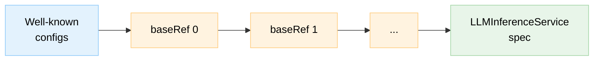

export const W = ({children}) => <span style={{color: 'var(--cfg-text-wellknown)'}}>{children}</span>;
export const B = ({children}) => <span style={{color: 'var(--cfg-text-baseref)'}}>{children}</span>;
export const S = ({children}) => <span style={{color: 'var(--cfg-text-spec)'}}>{children}</span>;
export const Note = ({children}) => <span style={{color: 'var(--cfg-text-note)', fontSize: '0.75rem'}}>{children}</span>;

# LLMInferenceService Config Composition

A full LLM inference deployment touches container images, probes, security contexts, scheduler settings, routing rules, resource limits, and more. Most users should not have to care about all of that. KServe ships sensible defaults that cover common deployments out of the box - a working service needs a model URI, a reference to a accelerator config, and a few feature toggles like routing and scheduling. When you do need to change something - a different GPU type, a custom routing policy, a longer startup probe - you override only that field and the defaults you did not touch stay in place.

When you create an LLMInferenceService, the controller does not apply your spec directly. Instead, it builds an **effective configuration** by merging multiple sources together using [Kubernetes strategic merge patch](https://kubernetes.io/docs/tasks/manage-kubernetes-objects/update-api-object-kubectl-patch/). This process - config composition - determines the final shape of the resources that will be responsible for reliably serving your model.

Understanding composition can be of great help when you need to debug unexpected behavior, override a default, or design reusable config fragments for your team.

> **Prerequisites**: Please have a look at the [LLMInferenceService overview](./llmisvc-overview.md) and the [configuration guide](./llmisvc-configuration.md) first.

---

## Configuration Sources and Merge Order

Three types of configuration participate in the merge, each with a different owner and priority:

| Source | Owner | Purpose | Priority |
|--------|-------|---------|----------|
| **Well-known configs** | Platform (shipped with KServe) | Auto-injected by the controller based on the spec shape. Set up the llm-d stack: vLLM container, scheduler, routes, probes, volumes, sidecars. | Lowest |
| **User `baseRefs`** | User or admin | `LLMInferenceServiceConfig` resources referenced via `spec.baseRefs`. Accelerator configs (GPU types, nodeSelectors, images), org-specific defaults. | Middle (ordered) |
| **`LLMInferenceService` spec** | User | The service itself. Model URI, replicas, field overrides. | Highest |

All selected configs are merged in a fixed order. Each step applies a Kubernetes strategic merge patch on top of the previous result. Later values override earlier ones.



Well-known configs are not created by users. They are installed as part of KServe and automatically selected by the controller based on the spec shape (see [Config Injection](#config-injection) below). User `baseRefs` are `LLMInferenceServiceConfig` resources that you or a platform admin create and reference in `spec.baseRefs` - multiple `baseRefs` are merged in order, later entries override earlier ones. The `LLMInferenceService` spec itself always wins.

---

## Example: Single-Node with Accelerator baseRef

Here is what a typical deployment looks like. The user writes a short `LLMInferenceService` that references a accelerator config via `baseRefs`, picks a model, enables routing and scheduling - and overrides the profile's default replica count from 2 to 3. The controller takes care of the rest.

**User provides**:

```yaml
apiVersion: serving.kserve.io/v1alpha1
kind: LLMInferenceService
metadata:
  name: llama-3-8b
  namespace: my-team
spec:
  baseRefs:
    - name: my-gpu-profile
  model:
    uri: hf://meta-llama/Llama-3.1-8B-Instruct
    name: meta-llama/Llama-3.1-8B-Instruct
  replicas: 3  # overrides baseRef's replicas: 2
  router:
    route: {}
    scheduler: {}
```

**Controller resolves**:

1. The spec has no `prefill` and no `worker` - this is a single-node deployment, so the controller injects `kserve-config-llm-template` to provide the base vLLM container, probes, volumes, and security context.
2. The spec has `router.scheduler` without an external pool ref - the controller injects `kserve-config-llm-scheduler` to create the Endpoint Picker (EPP) deployment and InferencePool that handle intelligent request routing.
3. The spec has `router.route` without external route refs - the controller injects `kserve-config-llm-router-route` to create the HTTPRoute rules that expose the service's inference endpoints through the Gateway.
4. The `baseRefs` reference `my-gpu-profile` - the controller fetches it from the `kserve` namespace (not found in `my-team`) to apply the GPU resources and node selector.

The sources that get merged (well-known configs are auto-injected, baseRef is resolved from the `kserve` namespace):

<div style={{display: 'flex', gap: '0.5rem', flexWrap: 'wrap', fontSize: '0.8rem', lineHeight: '1.4', marginBottom: '0.5rem'}}>

<div style={{flex: '1 1 180px', minWidth: '180px'}}>
<div style={{background: 'var(--cfg-blue-header)', padding: '0.4rem 0.6rem', borderRadius: '6px 6px 0 0', fontWeight: 600, fontSize: '0.75rem', borderBottom: '2px solid var(--cfg-blue-border)'}}><a href="https://github.com/kserve/kserve/blob/master/config/llmisvcconfig/config-llm-template.yaml" style={{color: 'inherit', textDecoration: 'none', borderBottom: '1px dashed var(--cfg-blue-border)'}}>kserve-config-llm-template</a></div>
<pre style={{margin: 0, padding: '0.6rem', borderRadius: '0 0 6px 6px', border: '1px solid var(--cfg-blue-header)', background: 'var(--cfg-blue-body)', fontSize: '0.8rem', lineHeight: '1.4'}}>
{"template:\n  containers:\n    - name: main\n      image: llm-d-cuda:v0.6.0\n      ports:\n        - containerPort: 8000\n      livenessProbe: [...]\n      readinessProbe: [...]\n      startupProbe: [...]\n      securityContext: [...]\n  volumes: [...]"}
</pre>
</div>

<div style={{alignSelf: 'center', fontSize: '1.2rem', fontWeight: 700, color: 'var(--cfg-separator)', padding: '0 0.15rem'}}>+</div>

<div style={{flex: '1 1 180px', minWidth: '180px'}}>
<div style={{background: 'var(--cfg-blue-header)', padding: '0.4rem 0.6rem', borderRadius: '6px 6px 0 0', fontWeight: 600, fontSize: '0.75rem', borderBottom: '2px solid var(--cfg-blue-border)'}}><a href="https://github.com/kserve/kserve/blob/master/config/llmisvcconfig/config-llm-scheduler.yaml" style={{color: 'inherit', textDecoration: 'none', borderBottom: '1px dashed var(--cfg-blue-border)'}}>kserve-config-llm-scheduler</a></div>
<pre style={{margin: 0, padding: '0.6rem', borderRadius: '0 0 6px 6px', border: '1px solid var(--cfg-blue-header)', background: 'var(--cfg-blue-body)', fontSize: '0.8rem', lineHeight: '1.4'}}>
{"router:\n  scheduler:\n    pool:\n      spec:\n        selector: [...]\n        targetPort: 8000\n    template:\n      containers:\n        - name: epp\n          image: llm-d-inference-scheduler\n          ports: [9002]\n        - name: tokenizer\n          image: llm-d-uds-tokenizer\n          ports: [8082]"}
</pre>
</div>

<div style={{alignSelf: 'center', fontSize: '1.2rem', fontWeight: 700, color: 'var(--cfg-separator)', padding: '0 0.15rem'}}>+</div>

<div style={{flex: '1 1 180px', minWidth: '180px'}}>
<div style={{background: 'var(--cfg-blue-header)', padding: '0.4rem 0.6rem', borderRadius: '6px 6px 0 0', fontWeight: 600, fontSize: '0.75rem', borderBottom: '2px solid var(--cfg-blue-border)'}}><a href="https://github.com/kserve/kserve/blob/master/config/llmisvcconfig/config-llm-router-route.yaml" style={{color: 'inherit', textDecoration: 'none', borderBottom: '1px dashed var(--cfg-blue-border)'}}>kserve-config-llm-router-route</a></div>
<pre style={{margin: 0, padding: '0.6rem', borderRadius: '0 0 6px 6px', border: '1px solid var(--cfg-blue-header)', background: 'var(--cfg-blue-body)', fontSize: '0.8rem', lineHeight: '1.4'}}>
{"router:\n  route:\n    http:\n      spec:\n        parentRefs:  # from KServe ingress config\n          - kind: Gateway\n        rules: [...]  # 8 rules total\n          # path + model-header per endpoint\n          # URLRewrite filters\n          # catch-all -> Service"}
</pre>
</div>

</div>

<div style={{textAlign: 'center', fontSize: '1.5rem', fontWeight: 700, color: 'var(--cfg-separator)', padding: '0.25rem 0'}}>+</div>

<div style={{display: 'flex', gap: '0.5rem', flexWrap: 'wrap', fontSize: '0.8rem', lineHeight: '1.4'}}>

<div style={{flex: '1 1 250px', minWidth: '250px'}}>
<div style={{background: 'var(--cfg-orange-header)', padding: '0.4rem 0.6rem', borderRadius: '6px 6px 0 0', fontWeight: 600, fontSize: '0.75rem', borderBottom: '2px solid var(--cfg-orange-border)'}}>baseRef: my-gpu-profile</div>
<pre style={{margin: 0, padding: '0.6rem', borderRadius: '0 0 6px 6px', border: '1px solid var(--cfg-orange-header)', background: 'var(--cfg-orange-body)', fontSize: '0.8rem', lineHeight: '1.4'}}>
{"replicas: 2\ntemplate:\n  nodeSelector:\n    nvidia.com/gpu.product: NVIDIA-A100-PCIE-40G\n  containers:\n    - name: main\n      resources:\n        requests:\n          nvidia.com/gpu: \"4\"\n          cpu: \"8\"\n          memory: 64Gi\n        limits:\n          nvidia.com/gpu: \"4\"\n          cpu: \"16\"\n          memory: 128Gi"}
</pre>
</div>

<div style={{alignSelf: 'center', fontSize: '1.5rem', fontWeight: 700, color: 'var(--cfg-separator)', padding: '0 0.5rem'}}>+</div>

<div style={{flex: '1 1 250px', minWidth: '250px'}}>
<div style={{background: 'var(--cfg-green-header)', padding: '0.4rem 0.6rem', borderRadius: '6px 6px 0 0', fontWeight: 600, fontSize: '0.75rem', borderBottom: '2px solid var(--cfg-green-border)'}}>LLMInferenceService spec</div>
<pre style={{margin: 0, padding: '0.6rem', borderRadius: '0 0 6px 6px', border: '1px solid var(--cfg-green-header)', background: 'var(--cfg-green-body)', fontSize: '0.8rem', lineHeight: '1.4'}}>
{"model:\n  uri: hf://meta-llama/Llama-3.1-8B-Instruct\n  name: meta-llama/Llama-3.1-8B-Instruct\nreplicas: 3\nrouter:\n  route: {}\n  scheduler: {}"}
</pre>
</div>

</div>

<div style={{textAlign: 'center', fontSize: '1.5rem', fontWeight: 700, color: 'var(--cfg-separator)', padding: '0.5rem 0'}}>=</div>

**Effective merged result**:

<div style={{border: '2px solid var(--cfg-gray-border)', borderRadius: '8px', overflow: 'hidden'}}>
<div style={{background: 'var(--cfg-gray-header)', padding: '0.5rem 0.75rem', fontWeight: 600, borderBottom: '1px solid var(--cfg-gray-border)'}}>Effective merged configuration</div>
<pre style={{margin: 0, padding: '0.75rem', fontSize: '0.82rem', lineHeight: '1.6', background: 'var(--cfg-gray-body)'}}>
<S>{"model:\n"}</S>
<S>{"  uri: hf://meta-llama/Llama-3.1-8B-Instruct\n"}</S>
<S>{"  name: meta-llama/Llama-3.1-8B-Instruct\n"}</S>
<S>{"replicas: 3"}</S><Note>{"                          ← spec overrides baseRef (was: 2)\n"}</Note>
<W>{"template:\n"}</W>
<B>{"  nodeSelector:\n"}</B>
<B>{"    nvidia.com/gpu.product: NVIDIA-A100-PCIE-40G\n"}</B>
<W>{"  containers:\n"}</W>
<W>{"    - name: main\n"}</W>
<W>{"      image: ghcr.io/llm-d/llm-d-cuda:v0.6.0\n"}</W>
<W>{"      ports:\n"}</W>
<W>{"        - containerPort: 8000\n"}</W>
<B>{"      resources:\n"}</B>
<B>{"        requests:\n"}</B>
<B>{'          nvidia.com/gpu: "4"\n'}</B>
<B>{'          cpu: "8"\n'}</B>
<B>{"          memory: 64Gi\n"}</B>
<B>{"        limits:\n"}</B>
<B>{'          nvidia.com/gpu: "4"\n'}</B>
<B>{'          cpu: "16"\n'}</B>
<B>{"          memory: 128Gi\n"}</B>
<W>{"      livenessProbe:\n"}</W>
<W>{"        httpGet:\n"}</W>
<W>{"          path: /health\n"}</W>
<W>{"          port: 8000\n"}</W>
<W>{"        periodSeconds: 10\n"}</W>
<W>{"      readinessProbe:\n"}</W>
<W>{"        httpGet:\n"}</W>
<W>{"          path: /health\n"}</W>
<W>{"          port: 8000\n"}</W>
<W>{"      startupProbe:\n"}</W>
<W>{"        httpGet:\n"}</W>
<W>{"          path: /health\n"}</W>
<W>{"          port: 8000\n"}</W>
<W>{"        failureThreshold: 120\n"}</W>
<W>{"        periodSeconds: 5\n"}</W>
<W>{"      securityContext:\n"}</W>
<W>{"        readOnlyRootFilesystem: true\n"}</W>
<W>{"        runAsNonRoot: true\n"}</W>
<W>{"  volumes:\n"}</W>
<W>{"    - name: shm\n"}</W>
<W>{"      emptyDir:\n"}</W>
<W>{"        medium: Memory\n"}</W>
<W>{"        sizeLimit: 1Gi\n"}</W>
<W>{"    - name: tmp\n"}</W>
<W>{"      emptyDir:\n"}</W>
<S>{"router:\n"}</S>
<S>{"  scheduler:\n"}</S>
<W>{"    pool:\n"}</W>
<W>{"      spec:\n"}</W>
<W>{"        selector: ...\n"}</W>
<W>{"        targetPort: 8000\n"}</W>
<W>{"    template:\n"}</W>
<W>{"      containers:\n"}</W>
<W>{"        - name: epp\n"}</W>
<W>{"          image: llm-d-inference-scheduler\n"}</W>
<W>{"          ports: [9002]\n"}</W>
<W>{"        - name: tokenizer\n"}</W>
<W>{"          image: llm-d-inference-scheduler\n"}</W>
<W>{"          ports: [8082]\n"}</W>
<S>{"  route:\n"}</S>
<W>{"    http:\n"}</W>
<W>{"      spec:\n"}</W>
<W>{"        parentRefs:  # from KServe ingress config\n          - kind: Gateway\n"}</W>
<W>{"        rules: [...]  # 8 rules: path + model-header per endpoint, catch-all"}</W>
</pre>
<div style={{background: 'var(--cfg-gray-header)', padding: '0.5rem 0.75rem', borderTop: '1px solid var(--cfg-gray-border)', fontSize: '0.78rem'}}>
  <W>{'█'}</W> Well-known config &nbsp;&nbsp;
  <B>{'█'}</B> User baseRef &nbsp;&nbsp;
  <S>{'█'}</S> LLMInferenceService spec
</div>
</div>

---

## Config Injection

The controller inspects the LLMInferenceService spec and auto-injects well-known configs based on two independent criteria: the **deployment pattern** and the **router components** you enable.

### Workload configs

The deployment pattern determines which workload config is injected. The controller looks at two fields - `spec.prefill` and `spec.worker` - to determine the topology:

- **Single-node**: Neither `prefill` nor `worker` is set. One `Deployment` runs the model on a single pod. This is the simplest topology, suitable for smaller models that fit on one node.
- **Multi-node (data parallel)**: `worker` is set with data parallelism. A `LeaderWorkerSet` distributes inference across multiple nodes, each running a shard of the model. Used when a model is too large for a single node or when you need higher throughput.
- **Disaggregated (prefill-decode)**: `prefill` is set. Prompt processing (prefill) and token generation (decode) run as separate workloads with independent scaling. This allows heterogeneous hardware - high-FLOPS GPUs for prefill, high-bandwidth GPUs for decode. Each side can also run multi-node with `worker` + data parallelism.

These paths are mutually exclusive.

| Your spec has... | Topology | Well-known config(s) injected |
|---|---|---|
| No `prefill`, no `worker` | Single-node | `kserve-config-llm-template` |
| No `prefill`, `worker` + DataParallel | Multi-node | `kserve-config-llm-worker-data-parallel` |
| `prefill` defined, no `worker` | Disaggregated, single-node each | `kserve-config-llm-prefill-template` + `kserve-config-llm-decode-template` |
| `prefill` defined, `worker` + DataParallel | Disaggregated, multi-node each | `kserve-config-llm-prefill-worker-data-parallel` + `kserve-config-llm-decode-worker-data-parallel` |

### Router configs

Router configs are injected independently and can combine with any workload config above.

| Your spec has... | Well-known config injected |
|---|---|
| `router.scheduler` without external pool ref | `kserve-config-llm-scheduler` |
| `router.route` without external route refs | `kserve-config-llm-router-route` |

A single-node deployment with a managed scheduler and route will inject three configs: `kserve-config-llm-template`, `kserve-config-llm-scheduler`, and `kserve-config-llm-router-route`.


---

## Strategic Merge Patch Behavior

The controller uses [Kubernetes strategic merge patch](https://kubernetes.io/docs/tasks/manage-kubernetes-objects/update-api-object-kubectl-patch/) to combine configs. The same merge logic applies at every step in the pipeline - well-known config + `baseRef`, `baseRef` + `baseRef`, and `baseRef` + spec. Here is how it works at the field level:

- **Non-zero fields** from the override are applied to the base. Existing base fields that the override does not mention are left untouched.
- **Zero-valued fields** (empty string `""`, `0`, `nil`, `false`) in the override do **not** overwrite base values. This prevents a config that does not specify a port from wiping out the well-known config's port.
- **Containers** are merged by name - the `main` container from different sources merges into a single `main` container rather than creating duplicates. Note that each pod spec (`template`, `worker`, `prefill`) has its own `main` container - these are separate and do not merge with each other. The merge only happens within the same pod spec across config layers. Other list fields like `volumes` and `env` follow standard Kubernetes strategic merge patch behavior.

### Example: Adding Resources Without Losing Existing Fields

```yaml
# Base (from well-known config)
template:
  containers:
    - name: main
      image: ghcr.io/llm-d/llm-d-cuda:v0.6.0
      ports:
        - containerPort: 8000

# Override (from baseRef) - only specifies resources
template:
  containers:
    - name: main
      resources:
        limits:
          nvidia.com/gpu: "1"

# Result - image and ports preserved, resources added
template:
  containers:
    - name: main
      image: ghcr.io/llm-d/llm-d-cuda:v0.6.0   # preserved from base
      ports:
        - containerPort: 8000                     # preserved from base
      resources:
        limits:
          nvidia.com/gpu: "1"                     # added from override
```

:::tip
When designing `baseRefs`, only include the fields you want to set or override. There is no need to repeat fields from the well-known config - they will be preserved through the merge.
:::

---

## Config Namespace Resolution

For each config reference (both well-known and baseRef), the controller looks up the `LLMInferenceServiceConfig` in this order:

1. **The LLMInferenceService's own namespace** (highest priority)
2. **The KServe system namespace** (typically `kserve`)
3. If not found in either namespace, the controller sets the [`PresetsCombined`](./llmisvc-status.md#top-level-conditions) condition to `False` with reason `ConfigNotFound`. This blocks reconciliation - `WorkloadsReady` and `RouterReady` will stay `Unknown` on a new service until the config is found

### Practical Implications

**Platform admins** ship shared configs in the `kserve` namespace. These are available to all services across the cluster.

**Teams** can create a same-name config in their own namespace to override the shared version. For example, if the `kserve` namespace contains `my-gpu-profile` with A100 settings, a team namespace can define its own `my-gpu-profile` with H100 settings - the local version takes precedence for services in that namespace.

**Debugging config resolution**: The `status.appliedConfigs` field records which configs were actually used and from where. Each entry is tagged with a `source` field:
- `Preset` - well-known config auto-injected by the controller
- `UserRef` - config referenced via `spec.baseRefs`

```yaml
status:
  appliedConfigs:
    - name: kserve-config-llm-template
      namespace: kserve
      source: Preset
    - name: my-gpu-profile
      namespace: my-team
      source: UserRef
```

:::note
See the [Status Reference](./llmisvc-status.md) for details on the `PresetsCombined` condition, `appliedConfigs` field, and troubleshooting config resolution failures.
:::

---

## Well-Known Config Reference

The controller ships with pre-installed `LLMInferenceServiceConfig` resources in the KServe system namespace. Each is injected automatically when the corresponding spec pattern is detected (see [Config Injection](#config-injection)).

| Config Name | Injected When | What It Sets Up |
|-------------|--------------|-----------------|
| `kserve-config-llm-template` | Single-node (no prefill, no worker) | vLLM container, probes, volumes, TLS, security context |
| `kserve-config-llm-worker-data-parallel` | Multi-node + DataParallel | Leader and worker templates, DP addressing, shared memory |
| `kserve-config-llm-prefill-template` | Disaggregated prefill (single-node) | Prefill container |
| `kserve-config-llm-decode-template` | Disaggregated decode (single-node) | Decode container, routing sidecar |
| `kserve-config-llm-prefill-worker-data-parallel` | Disaggregated prefill + multi-node DP | Multi-node prefill with DP addressing |
| `kserve-config-llm-decode-worker-data-parallel` | Disaggregated decode + multi-node DP | Multi-node decode with DP and routing sidecar |
| `kserve-config-llm-scheduler` | `router.scheduler` with inline pool | Endpoint Picker (EPP) deployment, tokenizer sidecar, InferencePool |
| `kserve-config-llm-router-route` | `router.route` without external route refs | HTTPRoute with path-based and model-header routing, URLRewrite, catch-all rules |

---

## Next Steps

- **[Configuration Guide](./llmisvc-configuration.md)**: Full field reference for LLMInferenceService spec
- **[Status Reference](./llmisvc-status.md)**: Understanding conditions, `appliedConfigs`, and troubleshooting
- **[Architecture Guide](../../../concepts/architecture/control-plane-llmisvc.md)**: How the controller processes these configs during reconciliation
