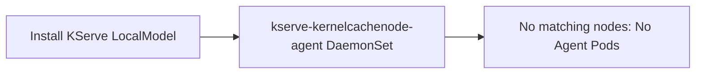
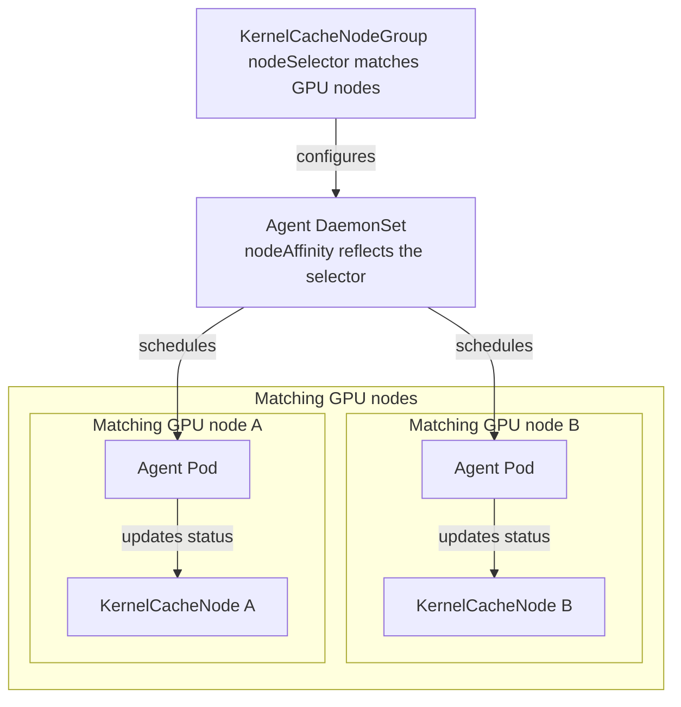

import useBaseUrl from '@docusaurus/useBaseUrl';

# Kernel Cache

Kernel Cache captures runtime-generated GPU kernel data from a serving workload and publishes it as an immutable OCI artifact. Later workloads can use the artifact when their runtime identity is compatible, reducing compilation work during startup.

Kernel Cache is different from model caching. Model caching stores model files before the server starts. Kernel Cache stores artifacts produced while the inference runtime initializes and compiles kernels.

## Current support scope

The current implementation supports `InferenceService` workloads with the vLLM runtime. When KServe resolves a cache path without an explicit path, it reads the vLLM `VLLM_CACHE_ROOT` environment variable. Triton cache environment variables are not currently supported for path resolution, so an accepted Triton OCI path does not imply Triton runtime integration. Registry access defaults to no authentication with `registry.auth.type: none`. For authenticated registries, `serviceAccountToken` is supported; it uses the Kubernetes TokenRequest API and requires configured push and pull role references.

`registry.endpoint` has no default and is required for automatically generated capture targets. Set it to the registry host with an optional port, without a URL scheme or repository path.

## How it works

The feature connects four Kubernetes custom resources:

| Resource | Scope | Purpose |
| --- | --- | --- |
| `KernelCacheNodeGroup` (`kcng`) | Cluster | Selects nodes that can prepare and serve a cache. |
| `KernelCacheNode` (`kcn`) | Cluster | Reports cache preparation and usage on one node. |
| `KernelCacheCapture` (`kcc`) | Namespace | Coordinates a capture session for a serving workload. |
| `KernelCache` (`kc`) | Namespace | Describes a completed OCI artifact and its target node group. |

## Architecture

The following diagram shows how configuration, capture, node preparation, and cache reuse work together. Click the diagram to open the full-size SVG.

  

The architecture has four cooperating paths:

- **Configuration and node setup**: The Kernel Cache configuration enables the controllers and webhook. A `KernelCacheNodeGroup` selects target nodes. The node controller derives Agent DaemonSet affinity from the selector and creates a `KernelCacheNode` for each matching node. The Agent Pod validates node-local cache state and reports it through the `KernelCacheNode`.
- **Capture**: When a producer Pod has no compatible prepared cache and sidecar injection is enabled, the admission webhook injects the MCV capture sidecar. MCV observes the runtime-generated cache, pushes an OCI image to the configured registry, and reports the runtime result to `KernelCacheCapture`.
- **Artifact preparation**: After a capture completes, the controller validates the reported artifact and creates a `KernelCache` containing the immutable OCI reference, cache paths, identity, and target node group. The controller creates an OCI prefetch Job for each ready node in that group. The Job causes the node to pull the OCI image, and the node agent reports the resulting preparation state.
- **Cache reuse**: For a new serving Pod, the admission webhook compares the Pod identity and cache paths with the `KernelCache` candidates and checks the node-local readiness reported by `KernelCacheNode`. When a compatible cache is ready, it adds the OCI image volume, init container, and read-only cache mounts to the Pod.

## Environment setup

`KernelCacheNodeGroup` and `KernelCacheNode` establish the node environment that can prepare and serve Kernel Cache artifacts:

## Node group and agent topology

`KernelCacheNodeGroup` selects the nodes where the agent runs. The controller creates an Agent DaemonSet with node affinity derived from the selector, and each Agent Pod reports the local state through its `KernelCacheNode` object:

The node controller and agent maintain `KernelCacheNode` objects for the configured environment. The capture and cache controllers own the artifact lifecycle and its status. The admission webhook only selects a cache when the workload identity, artifact paths, namespace, and node preparation state are compatible.

## Artifact and delivery model

The current API uses OCI delivery. A `KernelCache` artifact contains:

- An immutable image reference in the form `registry/repository@sha256:<digest>`.
- One or more cache paths.
- Identity factors and compatibility footprints used during selection.

Kernel Cache currently supports OCI image artifacts only. `KernelCache.spec.artifact` is immutable after the resource is created. `KernelCache.spec.mountType` is optional and defaults to `oci`; `oci` is currently the only accepted value.

The node group selects nodes and supplies tolerations used by the node agent and controller-managed preparation workloads. The node agent maintains node-local cache state, while OCI artifacts provide the cache contents.

## Relationship to model serving

Kernel Cache is integrated with KServe model serving through the workload Pod and its runtime container. The identity includes the workload, model source hash, runtime image, runtime command and arguments, and supported runtime configuration factors. The webhook uses these values to distinguish an exact workload match from a compatible cache match.

The current capture API accepts only `InferenceService` as the `sourceRef` kind. The current model-source resolver also supports the `InferenceService` path for automatic cache selection and capture. Do not assume that an `LLMInferenceService` Pod is supported just because the webhook has identity labels for that workload kind.

For a selected cache, the admission webhook adds an OCI image volume, an init container that materializes the artifact into the runtime cache paths, and read-only source mounts. This happens only after the node-local cache entry is ready and the identity and path checks succeed.
