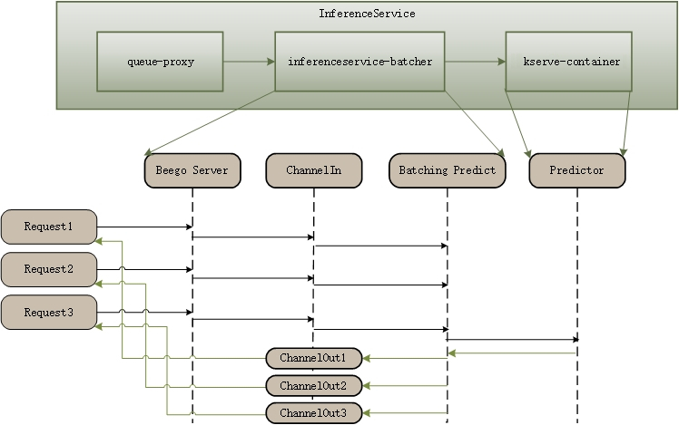

# Inference Batcher

This document explains how to configure batch prediction for any ML framework (TensorFlow, PyTorch, etc.) without decreasing performance.

The batcher is implemented in the KServe model agent sidecar. When requests arrive, they first hit the agent sidecar, and when a batch prediction is triggered, the request is sent to the model server container for inference.



## Prerequisites

- A Kubernetes cluster with [KServe installed](../../../getting-started/quickstart-guide.md).
- Basic understanding of KServe Concepts.

## How It Works

- The model agent container is injected into the InferenceService pod using webhooks when the batcher is enabled.
- Go channels are used to transfer data between HTTP request handlers and batcher go routines.
- Currently, batching is only implemented with KServe v1 HTTP protocol; gRPC is not supported yet.
- A batch prediction is triggered when either:
  - The number of instances (e.g., the number of images) reaches the `maxBatchSize`, or
  - The waiting time reaches the `maxLatency`

## Example

First, create a PyTorch predictor with a batcher. The `maxLatency` is set to a large value (500 milliseconds) to allow observation of the batching process.


```yaml
apiVersion: serving.kserve.io/v1beta1
kind: InferenceService
metadata:
  name: "torchserve"
spec:
  predictor:
    minReplicas: 1
    timeout: 60
    batcher:
      maxBatchSize: 32
      maxLatency: 500
    model:
      modelFormat:
        name: pytorch
      storageUri: gs://kfserving-examples/models/torchserve/image_classifier/v1
```

### Configuration Parameters

- **`maxBatchSize`**: The maximum batch size for triggering a prediction. Default: 32.
- **`maxLatency`**: The maximum latency for triggering a prediction (in milliseconds). Default: 500.
- **`timeout`**: Timeout for calling the predictor service (in seconds). Default: 60.

All these fields have default values in the code, so they are optional.

### Deploying the Model

```bash
kubectl create -f pytorch-batcher.yaml
```

### Sample Input

The following is a sample input for an image classification model:

```json
{
   "instances": [
     {
       "data": "iVBORw0KGgoAAAANSUhEUgAAABwAAAAcCAAAAABXZoBIAAAAw0lEQVR4nGNgGFggVVj4/y8Q2GOR83n+58/fP0DwcSqmpNN7oOTJw6f+/H2pjUU2JCSEk0EWqN0cl828e/FIxvz9/9cCh1zS5z9/G9mwyzl/+PNnKQ45nyNAr9ThMHQ/UG4tDofuB4bQIhz6fIBenMWJQ+7Vn7+zeLCbKXv6z59NOPQVgsIcW4QA9YFi6wNQLrKwsBebW/68DJ388Nun5XFocrqvIFH59+XhBAxThTfeB0r+vP/QHbuDCgr2JmOXoSsAAKK7bU3vISS4AAAAAElFTkSuQmCC",
       "target": 0
     }
   ]
}
```

### Testing the Model

We can now send requests to the PyTorch model. First, determine the ingress IP and ports and set `INGRESS_HOST` and `INGRESS_PORT`.

```bash
MODEL_NAME=mnist
INPUT_PATH=@./input.json
SERVICE_HOSTNAME=$(kubectl get inferenceservice torchserve -o jsonpath='{.status.url}' | cut -d "/" -f 3)

hey -z 10s -c 5 -m POST -host "${SERVICE_HOSTNAME}" -H "Content-Type: application/json" -D ./input.json "http://${INGRESS_HOST}:${INGRESS_PORT}/v1/models/$MODEL_NAME:predict"
```

The request will go to the model agent container first, where the batcher in the sidecar container batches the requests and sends the inference request to the predictor container.

:::tip

If the interval between sending two requests is less than `maxLatency`, the returned `batchId` will be the same.

:::

:::tip[Expected Output]

```
Summary:
  Total:	10.5361 secs
  Slowest:	0.5759 secs
  Fastest:	0.4983 secs
  Average:	0.5265 secs
  Requests/sec:	9.4912
  
  Total data:	24100 bytes
  Size/request:	241 bytes

Response time histogram:
  0.498 [1]	|■
  0.506 [0]	|
  0.514 [44]	|■■■■■■■■■■■■■■■■■■■■■■■■■■■■■■■■■■■■■■■■
  0.522 [21]	|■■■■■■■■■■■■■■■■■■■
  0.529 [4]	|■■■■
  0.537 [5]	|■■■■■
  0.545 [4]	|■■■■
  0.553 [0]	|
  0.560 [7]	|■■■■■■
  0.568 [4]	|■■■■
  0.576 [10]	|■■■■■■■■■


Latency distribution:
  10% in 0.5100 secs
  25% in 0.5118 secs
  50% in 0.5149 secs
  75% in 0.5406 secs
  90% in 0.5706 secs
  95% in 0.5733 secs
  99% in 0.5759 secs

Details (average, fastest, slowest):
  DNS+dialup:	0.0004 secs, 0.4983 secs, 0.5759 secs
  DNS-lookup:	0.0001 secs, 0.0000 secs, 0.0015 secs
  req write:	0.0002 secs, 0.0000 secs, 0.0076 secs
  resp wait:	0.5257 secs, 0.4981 secs, 0.5749 secs
  resp read:	0.0001 secs, 0.0000 secs, 0.0009 secs

Status code distribution:
  [200]	100 responses
```

:::
