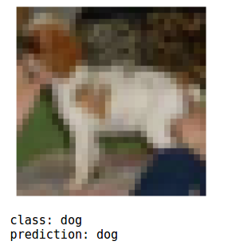
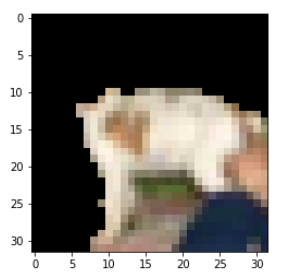

# CIFAR10 Image Classifier Explanation

We will use a Tensorflow classifier built on the [CIFAR10 image dataset](https://www.cs.toronto.edu/~kriz/cifar.html), which is a 10-class image dataset, to show an example of explanation on image data.

## Prerequisites
- Ensure you have a Kubernetes cluster with [KServe installed](../../../../../getting-started/quickstart-guide.md).
- The code sample for this example is available in the [KServe GitHub repository](https://github.com/kserve/kserve/tree/master/docs/samples/explanation/alibi/cifar10).

## Create the InferenceService with Alibi Explainer

```yaml
apiVersion: "serving.kserve.io/v1beta1"
kind: "InferenceService"
metadata:
  name: "cifar10"
spec:
  predictor:
    model:
      modelFormat:
        name: tensorflow
      storageUri: "gs://seldon-models/tfserving/cifar10/resnet32"
      resources:
        requests:
          cpu: 0.1
          memory: 5Gi
        limits:
          memory: 10Gi
  explainer:
    containers:
      - name: kserve-container
        image: kserve/alibi-explainer:v0.12.1
        args:
          - --model_name=cifar10
          - --http_port=8080
          - --predictor_host=cifar10-predictor.default
          - --storage_uri=/mnt/models
          - AnchorImages
          - --batch_size=40
          - --stop_on_first=True
        env:
          - name: STORAGE_URI
            value: "gs://kfserving-examples/models/tensorflow/cifar/explainer-0.9.1"
        resources:
          requests:
            cpu: 0.1
            memory: 5Gi
          limits:
            cpu: 1
            memory: 10Gi
```

:::note
The InferenceService resource describes:

- A pretrained TensorFlow model stored on a Google bucket
- An AnchorImage [Seldon Alibi](https://github.com/SeldonIO/alibi) Explainer. See the [Alibi Docs](https://docs.seldon.io/projects/alibi/en/stable/) for further details.
:::

## Test on notebook
Run this example using the [Jupyter notebook](https://github.com/kserve/kserve/blob/master/docs/samples/explanation/alibi/cifar10/cifar10_explanations.ipynb).

Once created you will be able to test the predictions:



And then get an explanation for it:


