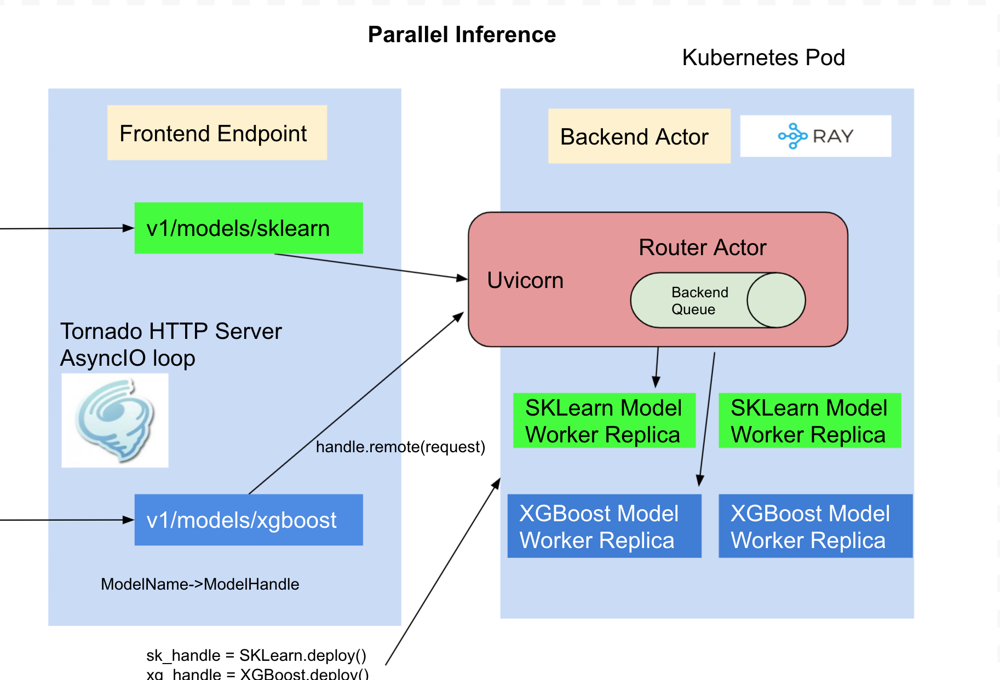

# Deploy Custom Python Serving Runtime with InferenceService

When the out-of-the-box `Serving Runtime` does not fit your need, you can choose to build your own model server using `KServe ModelServer API`
to deploy as `Custom Serving Runtime` on KServe.

## Create and Deploy Custom REST ServingRuntime

### Prerequisites
1. Install [pack CLI](https://buildpacks.io/docs/tools/pack/) to build your custom model server image.
2. [The code samples](https://github.com/kserve/website/tree/main/docs/model-serving/predictive-inference/frameworks/custom-predictor/rest) can be found in the KServe website repository.

### Implement Custom Model using KServe API
`KServe.Model` base class mainly defines three handlers `preprocess`, `predict` and `postprocess`, these handlers are executed
in sequence, the output of the `preprocess` is passed to `predict` as the input, the `predictor` handler executes the
inference for your model, the `postprocess` handler then turns the raw prediction result into user-friendly inference response. There
is an additional `load` handler which is used for writing custom code to load your model into the memory from local file system or
remote model storage, a general good practice is to call the `load` handler in the model server class `__init__` function, so your model
is loaded on startup and ready to serve prediction requests.

```python title="model.py"
import argparse
import base64
import io
import time

from fastapi.middleware.cors import CORSMiddleware
from torchvision import models, transforms
from typing import Dict
import torch
from PIL import Image

import kserve
from kserve import Model, ModelServer, logging
from kserve.model_server import app
from kserve.utils.utils import generate_uuid


class AlexNetModel(Model):
    def __init__(self, name: str):
        super().__init__(name, return_response_headers=True)
        self.name = name
        self.load()
        self.ready = False

    def load(self):
        self.model = models.alexnet(pretrained=True)
        self.model.eval()
        # The ready flag is used by model ready endpoint for readiness probes,
        # set to True when model is loaded successfully without exceptions.
        self.ready = True

    async def predict(
        self,
        payload: Dict,
        headers: Dict[str, str] = None,
        response_headers: Dict[str, str] = None,
    ) -> Dict:
        start = time.time()
        # Input follows the Tensorflow V1 HTTP API for binary values
        # https://www.tensorflow.org/tfx/serving/api_rest#encoding_binary_values
        img_data = payload["instances"][0]["image"]["b64"]
        raw_img_data = base64.b64decode(img_data)
        input_image = Image.open(io.BytesIO(raw_img_data))
        preprocess = transforms.Compose([
            transforms.Resize(256),
            transforms.CenterCrop(224),
            transforms.ToTensor(),
            transforms.Normalize(mean=[0.485, 0.456, 0.406],
                                 std=[0.229, 0.224, 0.225]),
        ])
        input_tensor = preprocess(input_image).unsqueeze(0)
        output = self.model(input_tensor)
        torch.nn.functional.softmax(output, dim=1)
        values, top_5 = torch.topk(output, 5)
        result = values.flatten().tolist()
        end = time.time()
        response_id = generate_uuid()

        # Custom response headers can be added to the inference response
        if response_headers is not None:
            response_headers.update(
                {"prediction-time-latency": f"{round((end - start) * 1000, 9)}"}
            )

        return {"predictions": result}


parser = argparse.ArgumentParser(parents=[kserve.model_server.parser])
args, _ = parser.parse_known_args()

if __name__ == "__main__":
    # Configure kserve and uvicorn logger
    if args.configure_logging:
        logging.configure_logging(args.log_config_file)
    model = AlexNetModel(args.model_name)
    model.load()
    # Custom middlewares can be added to the model
    app.add_middleware(
        CORSMiddleware,
        allow_origins=["*"],
        allow_credentials=True,
        allow_methods=["*"],
        allow_headers=["*"],
    )
    ModelServer().start([model])
```

:::tip
`return_response_headers=True` can be added to return response headers for v1 and v2 endpoints
:::

### Build Custom Serving Image with BuildPacks
[Buildpacks](https://buildpacks.io/) allows you to transform your inference code into images that can be deployed on KServe without
needing to define the `Dockerfile`. Buildpacks automatically determines the python application and then install the dependencies from the
`requirements.txt` file, it looks at the `Procfile` to determine how to start the model server. Here we are showing how to build the serving
image manually with `pack`, you can also choose to use [kpack](https://github.com/pivotal/kpack)
to run the image build on the cloud and continuously build/deploy new versions from your source git repository.

You can use pack cli to build and push the custom model server image
```bash
pack build --builder=heroku/builder:24 ${DOCKER_USER}/custom-model:v1
docker push ${DOCKER_USER}/custom-model:v1
```

:::tip 
If your buildpack command fails, make sure you have a [`.python-version`](https://github.com/kserve/website/tree/main/docs/model-serving/predictive-inference/frameworks/custom-predictor/rest/.python-version) file with the correct python version specified and a [`Procfile`](https://github.com/kserve/website/tree/main/docs/model-serving/predictive-inference/frameworks/custom-predictor/rest/Procfile) with correct entrypoint and arguments.
:::

### Deploy Locally and Test
Launch the docker image built from last step.
```bash
docker run -ePORT=8080 -p8080:8080 ${DOCKER_USER}/custom-model:v1
```

Send a test inference request locally with [input.json](./input.json)
```bash
curl -H "Content-Type: application/json" http://localhost:8080/v1/models/custom-model:predict -d @./input.json
```
:::tip[Expected Output]
```json
{"predictions": [[14.861763000488281, 13.94291877746582, 13.924378395080566, 12.182709693908691, 12.00634765625]]}
```
:::

### Deploy the REST Custom Serving Runtime on KServe

```yaml title="custom.yaml"
apiVersion: serving.kserve.io/v1beta1
kind: InferenceService
metadata:
  name: custom-model
spec:
  predictor:
    containers:
      - name: kserve-container
        image: ${DOCKER_USER}/custom-model:v1
        args:
          - --workers=1
          - --http_port=8080
          - --model_name=custom-model
        resources:
          limits:
            cpu: 2
            memory: 2Gi
          requests:
            cpu: 1
            memory: 1Gi
     
```
In the `custom.yaml` file edit the container image and replace $\{DOCKER_USER\} with your Docker Hub username.

#### Arguments
You can supply additional command arguments on the container spec to configure the model server.

- `--workers`: Spawn the specified number of `uvicorn` workers (multi-processing) of the model server, the default value is 1, this option is often used
  to help increase the resource utilization of the container.
- `--http_port`: The http port model server is listening on, the default REST port is 8080.
- `--grpc_port`: The GRPC Port listened to by the model server. Default is 8081.
- `--max_threads`: The max number of gRPC processing threads. Default is 4.
- `--enable_grpc`: Enable gRPC for the model server. Default is true.
- `--grpc_max_send_message_length`: The max message length for gRPC send message. Default is 8388608 bytes (8 MB).
- `--grpc_max_receive_message_length`: The max message length for gRPC receive message. Default is 8388608 bytes (8 MB).
- `--model_name`: The model name deployed in the model server, the default name the same as the service name.
- `--max_asyncio_workers`: Max number of workers to spawn for python async io loop, by default it is `min(32,cpu.limit + 4)`.
- `--enable_latency_logging`: Whether to log latency metrics per request, the default is True.
- `--configure_logging`: Whether to configure KServe and Uvicorn logging, the default is True.
- `--log_config_file`: The path of the Python config file configuration to use (can be a json, a yaml file or any other supported file format by 
python logging module). This file allows to override the default Uvicorn configuration shipped with KServe. The default is None.
- `--access_log_format`: A string representing the access log format configuration to use. The functionality is provided by the `asgi-logger` library and it allows to override only the `uvicorn.access`'s format configuration with a richer set of fields (output hardcoded to `stdout`). This limitation is currently due to the ASGI specs that don't describe how access logging should be implemented in detail (please refer to this Uvicorn [github issue](https://github.com/encode/uvicorn/issues/527) for more info). By default is None.
- `enable_latency_logging`: whether to log latency metrics per request, the default is True.
- `--enable_docs_url`: Enable docs url '/docs' to display Swagger UI.

#### Environment Variables

You can supply additional environment variables on the container spec.

- `STORAGE_URI`: load a model from a storage system supported by KServe e.g. `pvc://` `s3://`. This acts the same as `storageUri` when using a built-in predictor.
  The data will be available at `/mnt/models` in the container. For example, the following `STORAGE_URI: "pvc://my_model/model.onnx"` will be accessible at `/mnt/models/model.onnx`
- `PROTOCOL`: specify the protocol version supported by the model e.g `V1`. This acts the same as `protocolVersion` when using a built-in predictor.
- `KSERVE_LOGLEVEL`: sets the `kserve` and `kserve_trace`'s logger verbosity. Default is `INFO`.

Apply the YAML to deploy the InferenceService on KServe

```bash
kubectl apply -f custom.yaml
```

:::tip[Expected Output]
```bash
$ inferenceservice.serving.kserve.io/custom-model created
```
:::

### Run a Prediction
The first step is to [determine the ingress IP and ports](../../../../getting-started/predictive-first-isvc.md#4-determine-the-ingress-ip-and-ports) and set `INGRESS_HOST` and `INGRESS_PORT`

```bash
MODEL_NAME=custom-model
INPUT_PATH=@./input.json
SERVICE_HOSTNAME=$(kubectl get inferenceservice ${MODEL_NAME} -o jsonpath='{.status.url}' | cut -d "/" -f 3)

curl -v -H "Host: ${SERVICE_HOSTNAME}" -H "Content-Type: application/json" http://${INGRESS_HOST}:${INGRESS_PORT}/v1/models/${MODEL_NAME}:predict -d $INPUT_PATH
```

:::tip[Expected Output]
```bash
*   Trying 169.47.250.204...
* TCP_NODELAY set
* Connected to 169.47.250.204 (169.47.250.204) port 80 (#0)
> POST /v1/models/custom-model:predict HTTP/1.1
> Host: custom-model.default.example.com
> User-Agent: curl/7.64.1
> Accept: */*
> Content-Length: 105339
> Content-Type: application/x-www-form-urlencoded
> Expect: 100-continue
>
< HTTP/1.1 100 Continue
* We are completely uploaded and fine
< HTTP/1.1 200 OK
< content-length: 232
< content-type: text/html; charset=UTF-8
< date: Wed, 26 Feb 2020 15:19:15 GMT
< server: istio-envoy
< x-envoy-upstream-service-time: 213
<
* Connection #0 to host 169.47.250.204 left intact
{"predictions": [[14.861762046813965, 13.942917823791504, 13.9243803024292, 12.182711601257324, 12.00634765625]]}
```
:::

### Delete the InferenceService
```bash
kubectl delete -f custom.yaml
```


## Create and Deploy Custom gRPC ServingRuntime
KServe gRPC ServingRuntimes enables high performance inference data plane which implements the `Open(v2) Inference Protocol`:

- gRPC is built on top of HTTP/2 for addressing the
  shortcomings of [head-of-line-blocking](https://en.wikipedia.org/wiki/Head-of-line_blocking) and [pipelining](https://en.wikipedia.org/wiki/HTTP_pipelining),
- gRPC transports binary data format with [Protobuf](https://github.com/protocolbuffers/protobuf) which is efficient to send over the wire.

Compared to REST it has limited support for browser and the message is not human-readable which requires additional debugging tools.

### Prerequisites
1. Install [pack CLI](https://buildpacks.io/docs/tools/pack/) to build your custom model server image.
2. [The code samples](https://github.com/kserve/website/tree/main/docs/model-serving/predictive-inference/frameworks/custom-predictor/grpc) can be found in the KServe website repository.

### Implement Custom Model using KServe API
For `Open(v2) Inference Protocol`, KServe provides `InferRequest` and `InferResponse` API object for `predict`, `preprocess`, `postprocess`
handlers to abstract away the implementation details of REST/gRPC decoding and encoding over the wire.

```python title="model_grpc.py"
import argparse
import io
from typing import Dict

import torch
from PIL import Image
from torchvision import models, transforms

from kserve import InferRequest, InferResponse, Model, ModelServer, logging, model_server
from kserve.utils.utils import get_predict_response

# This custom predictor example implements the custom model following KServe
# v2 inference gPPC protocol, the input can be raw image bytes or image tensor
# which is pre-processed by transformer and then passed to predictor, the
# output is the prediction response.
class AlexNetModel(Model):
    def __init__(self, name: str):
        super().__init__(name)
        self.load()
        self.ready = False

    def load(self):
        self.model = models.alexnet(pretrained=True)
        self.model.eval()
        # The ready flag is used by model ready endpoint for readiness probes,
        # set to True when model is loaded successfully without exceptions.
        self.ready = True

    async def predict(
        self, payload: InferRequest,
        headers: Dict[str, str] = None,
        response_headers: Dict[str, str] = None,
    ) -> InferResponse:
        req = payload.inputs[0]
        if req.datatype == "BYTES":
            input_image = Image.open(io.BytesIO(req.data[0]))
            preprocess = transforms.Compose(
                [
                    transforms.Resize(256),
                    transforms.CenterCrop(224),
                    transforms.ToTensor(),
                    transforms.Normalize(
                        mean=[0.485, 0.456, 0.406], std=[0.229, 0.224, 0.225]
                    ),
                ]
            )
            input_tensor = preprocess(input_image)
            input_tensor = input_tensor.unsqueeze(0)
        elif req.datatype == "FP32":
            np_array = payload.inputs[0].as_numpy()
            input_tensor = torch.Tensor(np_array)

        output = self.model(input_tensor)
        torch.nn.functional.softmax(output, dim=1)
        values, top_5 = torch.topk(output, 5)
        result = values.detach().numpy()
        return get_predict_response(payload, result, self.name)


parser = argparse.ArgumentParser(parents=[model_server.parser])
args, _ = parser.parse_known_args()

if __name__ == "__main__":
    # Configure kserve and uvicorn logger
    if args.configure_logging:
        logging.configure_logging(args.log_config_file)
    model = AlexNetModel(args.model_name)
    model.load()
    ModelServer().start([model])
```

### Build Custom Serving Image with BuildPacks
Similar to building the REST custom image, you can also use pack cli to build and push the custom gRPC model server image
```bash
pack build --builder=heroku/builder:24 ${DOCKER_USER}/custom-model-grpc:v1
docker push ${DOCKER_USER}/custom-model-grpc:v1
```

:::tip 
If your buildpack command fails, make sure you have a [`.python-version`](https://github.com/kserve/website/tree/main/docs/model-serving/predictive-inference/frameworks/custom-predictor/grpc/.python-version) file with the correct python version specified and a [`Procfile`](https://github.com/kserve/website/tree/main/docs/model-serving/predictive-inference/frameworks/custom-predictor/grpc/Procfile) with correct entrypoint and arguments.
:::

### Deploy Locally and Test
Launch the docker image built from last step with `buildpack`.
```bash
docker run -ePORT=8081 -p8081:8081 ${DOCKER_USER}/custom-model-grpc:v1
```

Send a test inference request locally using `InferenceServerClient` [grpc_client.py](https://github.com/kserve/website/tree/main/docs/model-serving/predictive-inference/frameworks/custom-predictor/grpc/grpc_client.py)
```python title="grpc_client.py"
import asyncio
import json
import base64
import os

from kserve import InferRequest, InferInput
from kserve.inference_client import InferenceGRPCClient


async def main():
    client = InferenceGRPCClient(
        url=os.environ.get("INGRESS_HOST", "localhost") + ":" + os.environ.get("INGRESS_PORT", "8081"),
        channel_args=[('grpc.ssl_target_name_override', os.environ.get("SERVICE_HOSTNAME", ""))]
    )
    with open("../input.json") as json_file:
        data = json.load(json_file)
    infer_input = InferInput(name="input-0", shape=[1], datatype="BYTES",
                             data=[base64.b64decode(data["instances"][0]["image"]["b64"])])
    request = InferRequest(infer_inputs=[infer_input], model_name=os.environ.get("MODEL_NAME", "custom-model"))
    res = await client.infer(infer_request=request)
    print(res)

asyncio.run(main())
```

```bash
python grpc_client.py
```

:::tip[Expected Output]
```
"id": "b6a08abf-dcec-42ae-81af-084d9cad1c16","model_name": "custom-model","outputs": ["name": "output-0","shape": [1, 5],"datatype": "FP32","data": [14.975618362426758, 14.036808967590332, 13.966032028198242, 12.252279281616211, 12.086268424987793],"parameters": {}],"parameters": {},"from_grpc": True
```
:::

### Deploy the gRPC Custom Serving Runtime on KServe
Create the InferenceService yaml and expose the gRPC port by specifying on `ports` section, currently only one port is allowed to expose and by default HTTP port is exposed.
```yaml title="custom_grpc.yaml"
apiVersion: serving.kserve.io/v1beta1
kind: InferenceService
metadata:
  name: custom-model-grpc
spec:
  predictor:
    containers:
      - name: kserve-container
        image: ${DOCKER_USER}/custom-model-grpc:v1
        args:
          - --workers=1
          - --grpc_port=8081
          - --model_name=custom-model
        resources:
          limits:
            cpu: 2
            memory: 2Gi
          requests:
            cpu: 1
            memory: 1Gi
        ports:
          - name: h2c
            containerPort: 8081
            protocol: TCP
```
In the `custom_grpc.yaml` file edit the container image and replace $\{DOCKER_USER\} with your Docker Hub username.

#### Arguments
You can supply additional command arguments on the container spec to configure the model server.

- `--grpc_port`: the http port model server is listening on, the default gRPC port is 8081.
- `--model_name`: the model name deployed in the model server, the default name the same as the service name.


Apply the yaml to deploy the InferenceService on KServe

```bash
kubectl apply -f custom_grpc.yaml
```

:::tip[Expected Output]
```bash
$ inferenceservice.serving.kserve.io/custom-model-grpc created
```
:::

### Run a gRPC Prediction
The first step is to [determine the ingress IP and ports](../../../../getting-started/predictive-first-isvc.md#4-determine-the-ingress-ip-and-ports) and set `INGRESS_HOST` and `INGRESS_PORT`

```bash
MODEL_NAME=custom-model
SERVICE_HOSTNAME=$(kubectl get inferenceservice custom-model-grpc -o jsonpath='{.status.url}' | cut -d "/" -f 3)
```

Send an inference request to the gRPC service using `InferenceServerClient` [grpc_client.py](https://github.com/kserve/website/tree/main/docs/modelserving/v1beta1/custom/custom_model/grpc/grpc_client.py).

```bash
python grpc_client.py
```

:::tip[Expected Output]
```
"id": "b6a08abf-dcec-42ae-81af-084d9cad1c16","model_name": "custom-model","outputs": ["name": "output-0","shape": [1, 5],"datatype": "FP32","data": [14.975618362426758, 14.036808967590332, 13.966032028198242, 12.252279281616211, 12.086268424987793],"parameters": {}],"parameters": {},"from_grpc": True
```
:::

## Parallel Model Inference
By default, the models are loaded in the same process and inference is executed in the same process as the HTTP or gRPC server, if you are hosting multiple models the inference can only be run for one model at a time which limits the concurrency when you share the container for the models.
KServe integrates [RayServe](https://docs.ray.io/en/master/serve/index.html) which provides a programmable API to deploy models
as separate python workers so, the inference can be performed in parallel when serving multiple custom models.



### Prerequisites
1. Install [pack CLI](https://buildpacks.io/docs/tools/pack/) to build your custom model server image.
2. [The code samples](https://github.com/kserve/website/tree/main/docs/model-serving/predictive-inference/frameworks/custom-predictor/ray) can be found in the KServe website repository.


```python title="model_remote.py"
import argparse
import base64
import io
from typing import Dict

from torchvision import models, transforms
import torch
from PIL import Image
from ray import serve
from kserve import Model, ModelServer, logging, model_server
from kserve.ray import RayModel


# the model handle name should match the model endpoint name
@serve.deployment(name="custom-model", num_replicas=1)
class AlexNetModel(Model):
    def __init__(self, name):
        super().__init__(name)
        self.ready = False
        self.load()

    def load(self):
        self.model = models.alexnet(pretrained=True, progress=False)
        self.model.eval()
        # The ready flag is used by model ready endpoint for readiness probes,
        # set to True when model is loaded successfully without exceptions.
        self.ready = True

    async def predict(self, payload: Dict, headers: Dict[str, str] = None) -> Dict:
        inputs = payload["instances"]

        # Input follows the Tensorflow V1 HTTP API for binary values
        # https://www.tensorflow.org/tfx/serving/api_rest#encoding_binary_values
        data = inputs[0]["image"]["b64"]
        raw_img_data = base64.b64decode(data)
        input_image = Image.open(io.BytesIO(raw_img_data))
        preprocess = transforms.Compose(
            [
                transforms.Resize(256),
                transforms.CenterCrop(224),
                transforms.ToTensor(),
                transforms.Normalize(
                    mean=[0.485, 0.456, 0.406], std=[0.229, 0.224, 0.225]
                ),
            ]
        )

        input_tensor = preprocess(input_image)
        input_batch = input_tensor.unsqueeze(0)
        output = self.model(input_batch)
        torch.nn.functional.softmax(output, dim=1)
        values, top_5 = torch.topk(output, 5)
        return {"predictions": values.tolist()}

parser = argparse.ArgumentParser(parents=[model_server.parser])
args, _ = parser.parse_known_args()

if __name__ == "__main__":
    # Configure kserve and uvicorn logger
    if args.configure_logging:
        logging.configure_logging(args.log_config_file)
    app = AlexNetModel.bind(name=args.model_name)
    handle = serve.run(app)
    model = RayModel(name=args.model_name, handle=handle)
    model.load()
    ModelServer().start([model])
```
### Fractional GPU example
```python
import argparse
import base64
import io
from typing import Dict

from torchvision import models, transforms
import torch
from PIL import Image
import ray
from ray import serve
from kserve import Model, ModelServer, logging, model_server
from kserve.ray import RayModel


# the model handle name should match the model endpoint name
@serve.deployment(name="custom-model", num_replicas=1, ray_actor_options={"num_cpus":1, "num_gpus": 0.5})
class AlexNetModel(Model):
    def __init__(self, name):
        super().__init__(name)
        self.ready = False
        self.load()

    def load(self):
        self.model = models.alexnet(pretrained=True, progress=False)
        self.model.eval()
        # The ready flag is used by model ready endpoint for readiness probes,
        # set to True when model is loaded successfully without exceptions.
        self.ready = True

    async def predict(self, payload: Dict, headers: Dict[str, str] = None) -> Dict:
        inputs = payload["instances"]

        # Input follows the Tensorflow V1 HTTP API for binary values
        # https://www.tensorflow.org/tfx/serving/api_rest#encoding_binary_values
        data = inputs[0]["image"]["b64"]
        raw_img_data = base64.b64decode(data)
        input_image = Image.open(io.BytesIO(raw_img_data))
        preprocess = transforms.Compose(
            [
                transforms.Resize(256),
                transforms.CenterCrop(224),
                transforms.ToTensor(),
                transforms.Normalize(
                    mean=[0.485, 0.456, 0.406], std=[0.229, 0.224, 0.225]
                ),
            ]
        )

        input_tensor = preprocess(input_image)
        input_batch = input_tensor.unsqueeze(0)
        output = self.model(input_batch)
        torch.nn.functional.softmax(output, dim=1)
        values, top_5 = torch.topk(output, 5)
        return {"predictions": values.tolist()}

parser = argparse.ArgumentParser(parents=[model_server.parser])
args, _ = parser.parse_known_args()

if __name__ == "__main__":
    # Configure kserve and uvicorn logger
    if args.configure_logging:
        logging.configure_logging(args.log_config_file)
    ray.init(num_cpus=2, num_gpus=1)
    app = AlexNetModel.bind(name=args.model_name)
    handle = serve.run(app)
    model = RayModel(name=args.model_name, handle=handle)
    model.load()
    ModelServer().start([model])
```
The more details for ray fractional cpu and gpu can be found [here](https://docs.ray.io/en/latest/serve/resource-allocation.html#fractional-cpus-and-fractional-gpus).

### Build Custom Serving Image with BuildPacks

You can use pack cli to build the serving image which launches each model as separate python worker 
and web server routes to the model workers by name.
```bash
pack build --builder=heroku/builder:24 ${DOCKER_USER}/custom-model-ray:v1
docker push ${DOCKER_USER}/custom-model-ray:v1
```

:::tip 
If your buildpack command fails, make sure you have a [`.python-version`](https://github.com/kserve/website/tree/main/docs/model-serving/predictive-inference/frameworks/custom-predictor/ray/.python-version) file with the correct python version specified and a [`Procfile`](https://github.com/kserve/website/tree/main/docs/model-serving/predictive-inference/frameworks/custom-predictor/ray/Procfile) with correct entrypoint and arguments.
:::

### Deploy Locally and Test
Launch the docker image built from last step.
```bash
docker run -ePORT=8080 -p8080:8080 ${DOCKER_USER}/custom-model-ray:v1
```

Send a test inference request locally with [input.json](./input.json)
```bash
curl -H "Content-Type: application/json" http://localhost:8080/v1/models/custom-model:predict -d @./input.json
```
:::tip[Expected Output]
```json
{"predictions": [[14.861763000488281, 13.94291877746582, 13.924378395080566, 12.182709693908691, 12.00634765625]]}
```
:::

## Configuring Logger for Custom Serving Runtime
KServe allows users to override the default logger configuration of serving runtime and uvicorn server.
The logger configuration can be modified in one of the following ways:

### 1. Providing [logger configuration as a Dict](https://docs.python.org/3/library/logging.config.html#configuration-dictionary-schema):

If you are building a custom serving runtime and want to modify the logger configuration, this method offers the easiest solution.
You can supply the logging configuration as a Python Dictionary to the `kserve.logging.configure_logging()` method. If the logging dictionary is not provided, KServe uses the default configuration [KSERVE_LOG_CONFIG](https://github.com/kserve/kserve/blob/d19e31040c558ef88774736f67a0c2af7dbc6bc2/python/kserve/kserve/logging.py#L32).
```python
import argparse
import kserve
from kserve import logging

#################################
#       Source code             #
################################

parser = argparse.ArgumentParser(parents=[kserve.model_server.parser])
args, _ = parser.parse_known_args()
if __name__ == "__main__":
    # Example Dict config
    dictConfig = {
        "version": 1,
        "disable_existing_loggers": False,
        "formatters": {
            "kserve": {
                "()": "logging.Formatter",
                "fmt": "%(asctime)s.%(msecs)03d %(filename)s:%(funcName)s():%(lineno)s %(message)s",
                "datefmt": "%Y-%m-%d %H:%M:%S",
            },
            "kserve_trace": {
                "()": "logging.Formatter",
                "fmt": "%(asctime)s.%(msecs)03d %(name)s %(message)s",
                "datefmt": "%Y-%m-%d %H:%M:%S",
            },
            "uvicorn": {
                "()": "uvicorn.logging.DefaultFormatter",
                "datefmt": "%Y-%m-%d %H:%M:%S",
                "fmt": "%(asctime)s.%(msecs)03d %(name)s %(levelprefix)s %(message)s",
                "use_colors": None,
            },
        },
        "handlers": {
            "kserve": {
                "formatter": "kserve",
                "class": "logging.StreamHandler",
                "stream": "ext://sys.stderr",
            },
            "kserve_trace": {
                "formatter": "kserve_trace",
                "class": "logging.StreamHandler",
                "stream": "ext://sys.stderr",
            },
            "uvicorn": {
                "formatter": "uvicorn",
                "class": "logging.StreamHandler",
                "stream": "ext://sys.stderr",
            },
        },
        "loggers": {
            "kserve": {
                "handlers": ["kserve"],
                "level": "INFO",
                "propagate": False,
            },
            "kserve.trace": {
                "handlers": ["kserve_trace"],
                "level": "INFO",
                "propagate": False,
            },
            "uvicorn": {"handlers": ["uvicorn"], "level": "INFO", "propagate": False},
        },
    }
    if args.configure_logging:
        logging.configure_logging(dictConfig)
```
:::note
The logger should be configured before doing any actual work. A recommended best practice is to configure the logger
in the main, preferably as the first line of code. If the logger is configured later on in the source code, it may lead to
inconsistent logger formats.
:::

### 2. Providing logger configuration as a file:
The logger configuration can be provided as a file. If the filename ends with `.json`, KServe will treat the file as JSON Configuration.
If the filename ends with `.yaml` or `.yml`, KServe will treat the file as YAML Configuration. Otherwise, The file will be treated 
as a configuration file in the format specified in the [Python logging module documentation](https://docs.python.org/3/library/logging.config.html#configuration-file-format).
This offers a more flexible way of configuring the logger for pre-built serving runtimes.

The model server offers a command line argument which accepts a file path pointing to the configuration. For example,
```bash
sklearnserver --log_config_file=/path/to/config.yaml
```
For, Custom serving runtimes, they should accept the file path in their source code.
```python
import argparse

from kserve import logging
import kserve

#################################
#       Source code             #
################################

parser = argparse.ArgumentParser(parents=[kserve.model_server.parser])
args, _ = parser.parse_known_args()
if __name__ == "__main__":
    if args.configure_logging:
        logging.configure_logging(args.log_config_file)
           
```
Here is an example logging config in `JSON` format.
```json
{
  "version": 1,
  "disable_existing_loggers": false,
  "formatters": {
    "kserve": {
      "()": "logging.Formatter",
      "fmt": "%(asctime)s.%(msecs)03d %(filename)s:%(funcName)s():%(lineno)s %(message)s",
      "datefmt": "%Y-%m-%d %H:%M:%S"
    },
    "kserve_trace": {
      "()": "logging.Formatter",
      "fmt": "%(asctime)s.%(msecs)03d %(name)s %(message)s",
      "datefmt": "%Y-%m-%d %H:%M:%S"
    },
    "uvicorn": {
      "()": "uvicorn.logging.DefaultFormatter",
      "datefmt": "%Y-%m-%d %H:%M:%S",
      "fmt": "%(asctime)s.%(msecs)03d %(name)s %(levelprefix)s %(message)s",
      "use_colors": null
    }
  },
  "handlers": {
    "kserve": {
      "formatter": "kserve",
      "class": "logging.StreamHandler",
      "stream": "ext://sys.stderr"
    },
    "kserve_trace": {
      "formatter": "kserve_trace",
      "class": "logging.StreamHandler",
      "stream": "ext://sys.stderr"
    },
    "uvicorn": {
      "formatter": "uvicorn",
      "class": "logging.StreamHandler",
      "stream": "ext://sys.stderr"
    }
  },
  "loggers": {
    "kserve": {
      "handlers": [
        "kserve"
      ],
      "level": "INFO",
      "propagate": false
    },
    "kserve.trace": {
      "handlers": [
        "kserve_trace"
      ],
      "level": "INFO",
      "propagate": false
    },
    "uvicorn": {
      "handlers": [
        "uvicorn"
      ],
      "level": "INFO",
      "propagate": false
    }
  }
}
```

Here is an example using `YAML` format for configuring logger.
```yaml
version: 1
disable_existing_loggers: false
formatters:
  kserve:
    "()": logging.Formatter
    fmt: "%(asctime)s.%(msecs)03d %(filename)s:%(funcName)s():%(lineno)s %(message)s"
    datefmt: "%Y-%m-%d %H:%M:%S"
  kserve_trace:
    "()": logging.Formatter
    fmt: "%(asctime)s.%(msecs)03d %(name)s %(message)s"
    datefmt: "%Y-%m-%d %H:%M:%S"
  uvicorn:
    "()": uvicorn.logging.DefaultFormatter
    datefmt: "%Y-%m-%d %H:%M:%S"
    fmt: "%(asctime)s.%(msecs)03d %(name)s %(levelprefix)s %(message)s"
    use_colors: null
handlers:
  kserve:
    formatter: kserve
    class: logging.StreamHandler
    stream: ext://sys.stderr
  kserve_trace:
    formatter: kserve_trace
    class: logging.StreamHandler
    stream: ext://sys.stderr
  uvicorn:
    formatter: uvicorn
    class: logging.StreamHandler
    stream: ext://sys.stderr
loggers:
  kserve:
    handlers:
      - kserve
    level: INFO
    propagate: false
  kserve.trace:
    handlers:
      - kserve_trace
    level: INFO
    propagate: false
  uvicorn:
    handlers:
      - uvicorn
    level: INFO
    propagate: false

```
For other file formats, Please refer [Python docs](https://docs.python.org/3/library/logging.config.html#configuration-file-format).

### 3. Disabling logger Configuration:
If you don't want Kserve to configure the logger then, You can disable it by passing the commandline argument `--configure_logging=False` 
to the model server. The command line argument `--log_config_file` will be ignored, if the logger configuration is disabled.
In this case, the logger will inherit the root logger's configuration.

```bash
sklearnserver --configure_logging=False
```

:::note
If the logger is not configured at the entrypoint in the serving runtime (i.e. logging.configure_logger() is not invoked),
The model server will configure the logger using default configuration. But note that the logger is configured at 
model server initialization. So any logs before the initialization will use the root logger's configuration.
:::
