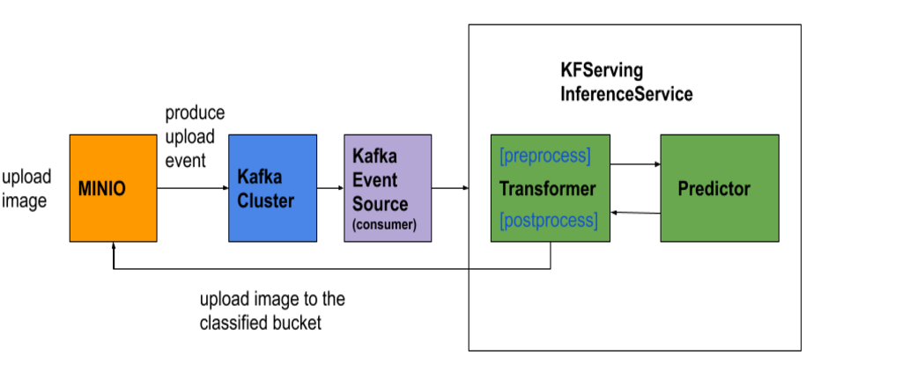

# End to End Inference Service Example with Minio and Kafka

This example demonstrates an end-to-end inference pipeline that processes a Kafka event and invokes the inference service to get predictions with provided pre/post processing code. The code for this example can be found [in the Kafka sample folder in the KServe repository](https://github.com/kserve/kserve/tree/master/docs/samples/kafka).



## Prerequisites

Before starting this tutorial, ensure you have:

- A Kubernetes cluster with [KServe installed](../../../getting-started/quickstart-guide.md).
- [Helm 3](https://helm.sh) installed (for deploying Kafka and Zookeeper).
- [Minio client (mc)](https://docs.min.io/docs/minio-client-complete-guide) installed.

## Deploy Kafka

If you don't have an existing Kafka cluster, run the following commands to [install in-cluster Kafka](https://github.com/bitnami/charts/blob/main/bitnami/kafka/README.md) and [Zookeeper](https://github.com/bitnami/charts/blob/main/bitnami/zookeeper/README.md) using Helm with persistence turned off.

```bash
helm repo add bitnami https://charts.bitnami.com/bitnami
helm install zookeeper bitnami/zookeeper --set replicaCount=1 --set auth.enabled=false --set allowAnonymousLogin=true \
  --set persistance.enabled=false --version 11.0.0
helm install kafka bitnami/kafka --set zookeeper.enabled=false --set replicaCount=1 --set persistance.enabled=false \
  --set logPersistance.enabled=false --set externalZookeeper.servers=zookeeper-headless.default.svc.cluster.local \
  --version 21.0.0
```

After successful installation, you should see the running Kafka cluster:

```bash
kubectl get pods
```

:::tip[Expected Output]

```
NAME                      READY   STATUS    RESTARTS   AGE
kafka-0                   1/1     Running   0          126m
zookeeper-0               1/1     Running   0          127m
```

:::

## Install Knative Eventing and Kafka Event Source

1. Install [Knative Eventing Core >= 1.2](https://knative.dev/docs/admin/install/eventing/install-eventing-with-yaml/)

```bash
kubectl apply -f https://github.com/knative/eventing/releases/download/knative-v1.9.7/eventing-crds.yaml
kubectl apply -f https://github.com/knative/eventing/releases/download/knative-v1.9.7/eventing-core.yaml
```

2. Install [Kafka Event Source](https://github.com/knative-sandbox/eventing-kafka/releases)

```bash
kubectl apply -f https://github.com/knative-sandbox/eventing-kafka/releases/download/knative-v1.9.1/source.yaml
```

3. Install `InferenceService` addressable cluster role

```yaml
apiVersion: rbac.authorization.k8s.io/v1
kind: ClusterRole
metadata:
  name: inferenceservice-addressable-resolver
  labels:
    contrib.eventing.knative.dev/release: devel
    duck.knative.dev/addressable: "true"
# Do not use this role directly. These rules will be added to the "addressable-resolver" role.
rules:
  - apiGroups:
      - serving.kserve.io
    resources:
      - inferenceservices
      - inferenceservices/status
    verbs:
      - get
      - watch
```

## Deploy Minio

If you don't have Minio set up in your cluster, run the following command to install a Minio test instance:

```yaml
apiVersion: apps/v1
kind: Deployment
metadata:
  labels:
    app: minio
  name: minio
spec:
  progressDeadlineSeconds: 600
  replicas: 1
  revisionHistoryLimit: 10
  selector:
    matchLabels:
      app: minio
  strategy:
    type: Recreate
  template:
    metadata:
      labels:
        app: minio
    spec:
      containers:
      - args:
        - server
        - /data
        env:
        - name: MINIO_ACCESS_KEY
          value: minio
        - name: MINIO_SECRET_KEY
          value: minio123
        image: minio/minio:RELEASE.2018-02-09T22-40-05Z
        imagePullPolicy: IfNotPresent
        name: minio
        ports:
        - containerPort: 9000
          protocol: TCP
---
apiVersion: v1
kind: Service
metadata:
  labels:
    app: minio
  name: minio-service
spec:
  ports:
    - port: 9000
      protocol: TCP
      targetPort: 9000
  selector:
    app: minio
  type: ClusterIP
```

Check the Minio status:

```bash
kubectl get pods -l app=minio
```

:::tip[Expected Output]

```
NAME                    READY   STATUS    RESTARTS   AGE
minio-6c949866f-452x5   1/1     Running   0          56s
```

:::

## Install Minio Client

1. Run port forwarding in a different terminal:

```bash
kubectl port-forward $(kubectl get pod --selector="app=minio" --output jsonpath='{.items[0].metadata.name}') 9000:9000
```

2. Configure the Minio client:

```bash
mc config host add myminio http://127.0.0.1:9000 minio minio123
```

3. Create buckets `mnist` for uploading images and `digits` for uploading the classified images:

```bash
mc mb myminio/mnist
mc mb myminio/digits
```

4. Set up event notification to publish events to Kafka:

```bash
# Setup bucket event notification with Kafka
mc admin config set myminio notify_kafka:1 tls_skip_verify="off" queue_dir="" queue_limit="0" sasl="off" sasl_password="" sasl_username="" tls_client_auth="0" tls="off" client_tls_cert="" client_tls_key="" brokers="kafka-headless.default.svc.cluster.local:9092" topic="mnist" version=""

# Restart Minio
mc admin service restart myminio

# Setup event notification when putting images to the bucket
mc event add myminio/mnist arn:minio:sqs::1:kafka -p --event put --suffix .png
```

## Upload the MNIST Model to Minio

```bash
gsutil cp -r gs://kfserving-examples/models/tensorflow/mnist .
mc cp -r mnist myminio/
```

## Create S3 Secret for Minio and Attach to Service Account

KServe gets secrets from your service account. You need to add the created or existing secret to your service account's secret list. By default, KServe uses the `default` service account, but users can use their own service account and override it in the `InferenceService` CRD.

Apply the secret and attach it to the service account:

```yaml
apiVersion: v1
kind: Secret
metadata:
  name: mysecret
  annotations:
    serving.kserve.io/s3-endpoint: minio-service:9000 # replace with your s3 endpoint
    serving.kserve.io/s3-usehttps: "0" # by default 1, for testing with minio you need to set to 0
type: Opaque
data:
  AWS_ACCESS_KEY_ID: bWluaW8=
  AWS_SECRET_ACCESS_KEY: bWluaW8xMjM=
---
apiVersion: v1
kind: ServiceAccount
metadata:
  name: default
secrets:
  - name: mysecret
--- 
```

:::tip[Expected Output]

```
secret/mysecret created
serviceaccount/default created
```

:::

## Build MNIST Transformer Image

The transformation image implements:
- A preprocess handler to process the Minio notification event, download the image from Minio, and transform image bytes to tensors
- A postprocess handler to process the prediction and upload the image to the classified Minio bucket `digits`

```bash
docker build -t $USERNAME/mnist-transformer:latest -f ./transformer.Dockerfile .
docker push $USERNAME/mnist-transformer:latest
```

## Create the InferenceService

Specify the built image on `Transformer` spec and apply the InferenceService CRD:

```yaml
apiVersion: serving.kserve.io/v1beta1
kind: InferenceService
metadata:
  name: mnist
spec:
  predictor:
    minReplicas: 1
    model:
      modelFormat:
        name: tensorflow
      storageUri: 's3://mnist'
  transformer:
    minReplicas: 1
    containers:
      - name: kserve-container
        image: '${USERNAME}/mnist-transformer:latest'
        resources:
          requests:
            cpu: 100m
            memory: 100Mi
          limits:
            cpu: 100m
            memory: 100Mi
```

This creates transformer and predictor pods. The request goes to the transformer first, where it invokes the preprocess handler. The transformer then calls out to the predictor to get the prediction response, which in turn invokes the postprocess handler.

```bash
kubectl get pods -l serving.kserve.io/inferenceservice=mnist
```

:::tip[Expected Output]

```
NAME                                                  READY   STATUS    RESTARTS    AGE
mnist-predictor-00001-deployment-7786656484-7zrcr     2/2     Running    0          10s
mnist-transformer-00001-deployment-68b6b695f6-4qhdj   2/2     Running    0          5s
```

:::

## Create Kafka Event Source

Apply the Kafka event source, which creates the Kafka consumer pod to pull events from Kafka and deliver them to the inference service:

```yaml
apiVersion: sources.knative.dev/v1beta1
kind: KafkaSource
metadata:
  name: kafka-source
spec:
  consumerGroup: knative-group
  # Broker URL. Replace this with the URLs for your Kafka cluster,
  # which is in the format of my-cluster-kafka-bootstrap.my-kafka-namespace:9092.
  bootstrapServers:
    - kafka-headless.default.svc.cluster.local:9092
  topics:
    - mnist
  sink:
    ref:
      apiVersion: serving.kserve.io/v1beta1
      kind: InferenceService
      name: mnist
    uri: /v1/models/mnist:predict
```

Check the Kafka source status:

```bash
kubectl get kafkasource kafka-source
```

:::tip[Expected Output]

```
NAME           TOPICS      BOOTSTRAPSERVERS                                    READY   REASON   AGE
kafka-source   ["mnist"]   ["kafka-headless.default.svc.cluster.local:9092"]   True             81s
```

:::

This creates the Kafka source pod, which consumes events from the `mnist` topic:

```bash
kubectl get pods
```

:::tip[Expected Output]

```
NAME                                                              READY   STATUS    RESTARTS   AGE
kafkasource-kafka-source-3d809fe2-1267-11ea-99d0-42010af00zbn5h   1/1     Running   0          75s
```

:::

## Upload a Digit Image to Minio MNIST Bucket

The last step is to upload the [sample image](./0.png). After uploading, the image should be moved to the classified bucket based on the prediction response:

```bash
mc cp 0.png myminio/mnist
```

You should expect a notification event like the following sent to Kafka topic `mnist` after uploading an image in the `mnist` bucket:

:::tip[Expected Output]

```json
{
   "EventType":"s3:ObjectCreated:Put",
   "time":"2019-11-17T19:08:08Z"
}
```

:::

Check the transformer log. You should expect a prediction response and see that the image was put into the corresponding bucket:

```bash
kubectl logs mnist-transformer-00001-deployment-68b6b695f6-4qhdj -c kserve-container
```

:::tip[Expected Output]

```
2023-04-11 08:48:20.811 1 root INFO [register_model():187] Registering model: mnist
2023-04-11 08:48:20.811 1 root INFO [start():129] Setting max asyncio worker threads as 12
2023-04-11 08:48:20.811 1 root INFO [serve():139] Starting uvicorn with 1 workers
2023-04-11 08:48:21.016 1 uvicorn.error INFO [serve():84] Started server process [1]
2023-04-11 08:48:21.017 1 uvicorn.error INFO [startup():45] Waiting for application startup.
2023-04-11 08:48:21.113 1 root INFO [start():62] Starting gRPC server on [::]:8081
2023-04-11 08:48:21 DEBUG [timing_asgi.middleware:40] ASGI scope of type lifespan is not supported yet
2023-04-11 08:48:21.113 1 uvicorn.error INFO [startup():59] Application startup complete.
2023-04-11 08:55:07.439 1 root INFO [preprocess():47] Received input {'attributes': {'specversion': '1.0', 'id': 'partition:0/offset:0', 'source': '/apis/v1/namespaces/default/kafkasources/kafka-source#mnist', 'type': 'dev.knative.kafka.event', 'subject': 'partition:0#0', 'key': 'mnist/0.png', 'time': '2023-04-11T08:55:07.439730+00:00'}, 'data': b'{"EventName":"s3:ObjectCreated:Put","Key":"mnist/0.png","Records":[{"eventVersion":"2.0","eventSource":"minio:s3","awsRegion":"","eventTime":"2023-04-11T08:55:07.400Z","eventName":"s3:ObjectCreated:Put","userIdentity":{"principalId":"minio"},"requestParameters":{"accessKey":"minio","region":"","sourceIPAddress":"127.0.0.1"},"responseElements":{"content-length":"0","x-amz-request-id":"1754D58029FE3874","x-minio-deployment-id":"b8f18e35-1f04-48d4-b94b-f9704a69453f","x-minio-origin-endpoint":"http://10.244.0.164:9000"},"s3":{"s3SchemaVersion":"1.0","configurationId":"Config","bucket":{"name":"mnist","ownerIdentity":{"principalId":"minio"},"arn":"arn:aws:s3:::mnist"},"object":{"key":"0.png","size":324,"eTag":"ebed21f6f77b0a64673a3c96b0c623ba","contentType":"image/png","userMetadata":{"content-type":"image/png"},"sequencer":"1754D5802CCFEDA0"}},"source":{"host":"127.0.0.1","port":"","userAgent":"MinIO (linux; amd64) minio-go/v7.0.49 mc/RELEASE.2023-03-23T20-03-04Z"}}]}'}
2023-04-11 08:55:07.440 1 root INFO [preprocess():50] Event data {'EventName': 's3:ObjectCreated:Put', 'Key': 'mnist/0.png', 'Records': [{'eventVersion': '2.0', 'eventSource': 'minio:s3', 'awsRegion': '', 'eventTime': '2023-04-11T08:55:07.400Z', 'eventName': 's3:ObjectCreated:Put', 'userIdentity': {'principalId': 'minio'}, 'requestParameters': {'accessKey': 'minio', 'region': '', 'sourceIPAddress': '127.0.0.1'}, 'responseElements': {'content-length': '0', 'x-amz-request-id': '1754D58029FE3874', 'x-minio-deployment-id': 'b8f18e35-1f04-48d4-b94b-f9704a69453f', 'x-minio-origin-endpoint': 'http://10.244.0.164:9000'}, 's3': {'s3SchemaVersion': '1.0', 'configurationId': 'Config', 'bucket': {'name': 'mnist', 'ownerIdentity': {'principalId': 'minio'}, 'arn': 'arn:aws:s3:::mnist'}, 'object': {'key': '0.png', 'size': 324, 'eTag': 'ebed21f6f77b0a64673a3c96b0c623ba', 'contentType': 'image/png', 'userMetadata': {'content-type': 'image/png'}, 'sequencer': '1754D5802CCFEDA0'}}, 'source': {'host': '127.0.0.1', 'port': '', 'userAgent': 'MinIO (linux; amd64) minio-go/v7.0.49 mc/RELEASE.2023-03-23T20-03-04Z'}}]}
2023-04-11 08:55:07.813 1 root INFO [postprocess():62] response: {'predictions': [{'predictions': [0.0247901566, 1.37231364e-05, 0.0202635303, 0.39037028, 0.000513458275, 0.435112566, 0.000607515569, 0.00041125578, 0.127784252, 0.000133168287], 'classes': 5}]}
2023-04-11 08:55:07.813 1 root INFO [postprocess():64] digit:5
2023-04-11 08:55:07.833 1 root INFO [postprocess():67] Image 0.png successfully uploaded to digit-5/0.png
2023-04-11 08:55:07.833 1 root INFO [__call__():128] requestId: 13ce4fc0-6723-4230-8d2f-2e6bc6f68933, preprocess_ms: 75.415849686, explain_ms: 0, predict_ms: 297.461032867, postprocess_ms: 20.473003387
2023-04-11 08:55:07.834 1 root INFO [timing():48] kserve.io.kserve.protocol.rest.v1_endpoints.predict 0.39476728439331055, ['http_status:200', 'http_method:POST', 'time:wall']
2023-04-11 08:55:07.834 1 root INFO [timing():48] kserve.io.kserve.protocol.rest.v1_endpoints.predict 0.03562399999999988, ['http_status:200', 'http_method:POST', 'time:cpu']
```

:::
