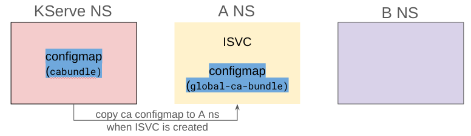
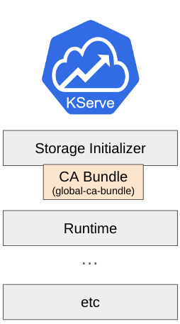
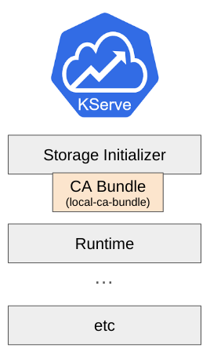

# KServe with Self-Signed Certificate Model Registry

If you are using a model registry with a self-signed certificate, you must either skip SSL verification or apply the appropriate CA bundle to the storage-initializer to create a connection with the registry.
This document explains three methods that can be used in KServe, described below:

- Configure CA bundle for storage-initializer
    - Global configuration
    - Namespace scope configuration (Using `storage-config` Secret)
        - JSON
        - Annotation
- Skip SSL Verification
  
:::note

This is only available for `Standard` and `Knative`. For ModelMesh, you should add CA bundle content into the [`certificate` parameter in `storage-config`](https://github.com/kserve/modelmesh-serving/blob/main/docs/predictors/setup-storage.md).

:::

## Configure CA Bundle for Storage-Initializer

### Global Configuration

KServe uses the `inferenceservice-config` ConfigMap for default configuration. If you want to add a `cabundle` certificate for every inference service, you can set `caBundleConfigMapName` in the ConfigMap. Before updating the ConfigMap, you have to create a ConfigMap for the CA bundle certificate in the namespace where the KServe controller is running. The data key in the ConfigMap must be `cabundle.crt`.



1. Create a CA ConfigMap with the CA bundle certificate:

```bash
kubectl create configmap cabundle --from-file=/path/to/cabundle.crt

kubectl get configmap cabundle -o yaml
```

The output should look like:
```yaml
apiVersion: v1
data:
  cabundle.crt: XXXXX
kind: ConfigMap
metadata:
  name: cabundle
  namespace: kserve
```

2. Update the `inferenceservice-config` ConfigMap:

```yaml
storageInitializer: |-
  {
      ...
      "caBundleConfigMapName": "cabundle",
      ...
  }
```
  
After you update this configuration, please restart the KServe controller pod to pick up the change.

When you create an inference service, the CA bundle will be copied to your user namespace and attached to the storage-initializer container.



### Using Storage-Config Secret

If you want to apply the CA bundle only to a specific InferenceService, you can use a specific annotation or variable (`cabundle_configmap`) on the `storage-config` Secret used by the InferenceService.
In this case, you have to create the CA bundle ConfigMap in the user namespace before you create the InferenceService.



1. Create a ConfigMap with the CA bundle certificate:

```bash
kubectl create configmap local-cabundle --from-file=/path/to/cabundle.crt

kubectl get configmap local-cabundle -o yaml
```

The output should look like:
```yaml
apiVersion: v1
data:
  cabundle.crt: XXXXX
kind: ConfigMap
metadata:
  name: local-cabundle
  namespace: kserve-demo
```

2. You can use one of the following approaches:

#### Add an annotation to `storage-config` Secret

```yaml
apiVersion: v1
data:
  AWS_ACCESS_KEY_ID: VEhFQUNDRVNTS0VZ
  AWS_SECRET_ACCESS_KEY: VEhFUEFTU1dPUkQ=
kind: Secret
metadata:
  annotations:
    serving.kserve.io/s3-cabundle-configmap: local-cabundle
    ...
  name: storage-config
  namespace: kserve-demo
type: Opaque
```

#### Or, set a variable in the `storage-config` Secret

```yaml
apiVersion: v1
stringData:
  localMinIO: |
    {
      "type": "s3",
      ...
      "cabundle_configmap": "local-cabundle"
    }
kind: Secret
metadata:
  name: storage-config
  namespace: kserve-demo
type: Opaque
```

## Skip SSL Verification

For testing purposes or when there is no CA bundle available, you can easily create an SSL connection by disabling SSL verification.
This can be done by adding an annotation or setting a variable in the `storage-config` Secret.

### Add an annotation to `storage-config` Secret

```yaml
apiVersion: v1
data:
  AWS_ACCESS_KEY_ID: VEhFQUNDRVNTS0VZ
  AWS_SECRET_ACCESS_KEY: VEhFUEFTU1dPUkQ=
kind: Secret
metadata:
  annotations:
    serving.kserve.io/s3-verifyssl: "0" # 1 is true, 0 is false
    ...
  name: storage-config
  namespace: kserve-demo
type: Opaque
```

### Or, set a variable in the `storage-config` Secret

```yaml
apiVersion: v1
stringData:
  localMinIO: |
    {
      "type": "s3",
      ...
      "verify_ssl": "0"  # 1 is true, 0 is false  (You can also use True/true/False/false)
    }
kind: Secret
metadata:
  name: storage-config
  namespace: kserve-demo
type: Opaque
```
