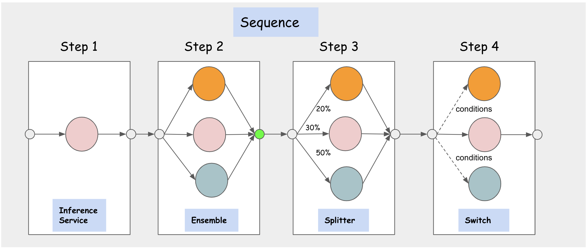

# Inference Graph

## Motivation

ML inference system is getting bigger and more complex, it often consists of many models to make a single prediction. The common use cases are image classification and nature language processing pipelines.
For example, a face recognition pipeline may need to find the face area first and then compute the features of the faces to match the database; a NLP pipeline needs to run a document classification first then
downstream named entity detection based on previous classification results.

KServe has the unique strength to build distributed inference graph: graph router autoscaling, native integration with individual `InferenceServices`, standard inference protocol for chaining models. KServe
leverage these strengths to build `InferenceGraph` and enable users to deploy complex ML inference pipelines to production in a declarative and scalable way.

## Concepts



* **InferenceGraph**: It is made up with a list of routing `Nodes`, each `Node` consists of a set of routing `Steps`.
  Each `Step` can either route to an `InferenceService` or another `Node` defined on the graph which makes the `InferenceGraph`
  highly composable. The graph router is deployed behind an HTTP endpoint and can be scaled dynamically based on request volume.
  The `InferenceGraph` supports four different types of Routing `Nodes`: **Sequence**, **Switch**, **Ensemble**, **Splitter**.


* **Sequence Node**: It allows users to define multiple `Steps` with `InferenceServices` or `Nodes` as routing targets in a sequence.
  The `Steps` are executed in sequence and the request/response from previous step can be passed to the next step as input based on
  configuration.


* **Switch Node**: It allows users to define routing conditions and select a step to execute if it matches the condition, the response
  is returned as soon it finds the first step that matches the condition. If no condition is matched, the graph returns the original request.


* **Ensemble Node**: A model ensemble requires scoring each model separately and then combining the results into a single prediction response.
  You can then use different combination methods to produce the final result. Multiple classification trees, for example, are commonly combined
  using a "majority vote" method. Multiple regression trees are often combined using various averaging techniques.


* **Splitter Node**: It allows users to split the traffic to multiple targets using a weighted distribution.

## Features

#### Headers Propagation
If you want IG router to propagate the headers, you passed in the request to IG, to all the steps in your graph then you can do so using `inferenceservice-config`
config-map in kserve namespace.
For example:
If you want to propagate a certain header, say "Custom-Header", then you can edit the `router` section of `inferenceservice-config`
config-map like this :
```
{
    "image" : "kserve/router:v0.9.0",
    "memoryRequest": "100Mi",
    "memoryLimit": "1Gi",
    "cpuRequest": "100m",
    "cpuLimit": "1",
    "headers": {
      "propagate":[
        "Custom-Header"
      ]
    }
}
```
Once you update this config-map, kserve controller will automatically reconcile IG to start propagating headers.