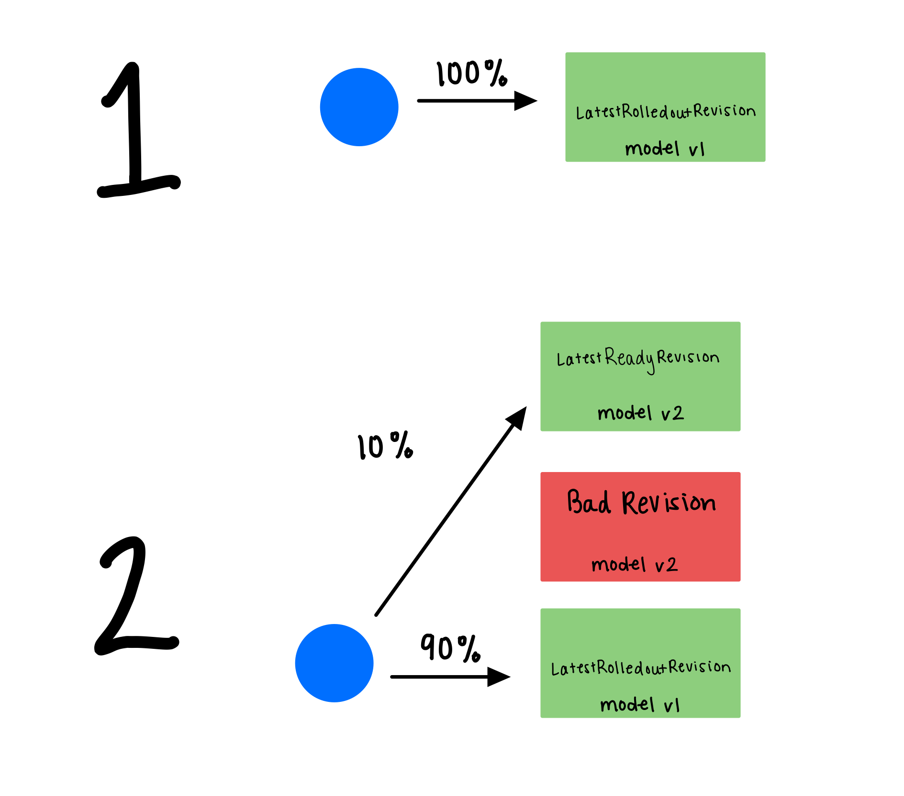

# Canary Rollout Strategy 

KServe supports canary rollouts for inference services. Canary rollouts allow for a new version of an InferenceService to receive a percentage of traffic. Kserve supports a configurable canary rollout strategy with multiple steps. The rollout strategy can also be implemented to rollback to the previous revision if a rollout step fails.

KServe automatically tracks the last good revision that was rolled out with 100% traffic. The `canaryTrafficPercent` field in the component's spec needs to be set with the percentage of traffic that should be routed to the new revision. KServe will then automatically split the traffic between the last good revision and the revision that is currently being rolled out according to the `canaryTrafficPercent` value. 

When the first revision of an `InferenceService` is deployed, it will receive 100% of the traffic. When multiple revisions are deployed, as in step 2, and the canary rollout strategy is configured to route 10% of the traffic to the new revision, 90% of the traffic will go to the `LastestRolledoutRevision`. If there is an unhealthy or bad revision applied, traffic will not be routed to that bad revision. In step 3, the rollout strategy promotes the `LatestReadyRevision` from step 2 to the `LatestRolledoutRevision`. Since it is now promoted, the `LatestRolledoutRevision` gets 100% of the traffic and is fully rolled out. If a rollback needs to happen, 100% of the traffic will be pinned to the previous healthy/good revision- the `PreviousRolledoutRevision`.     

