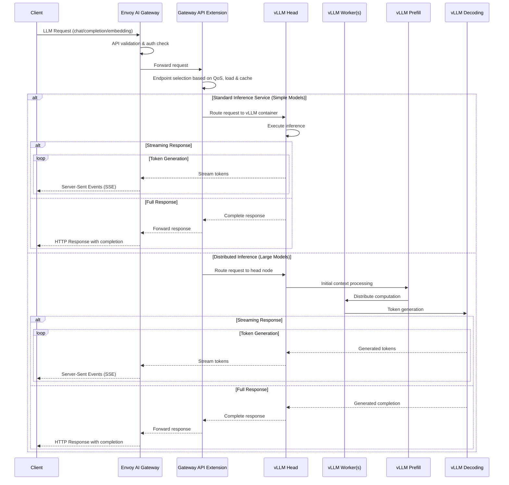
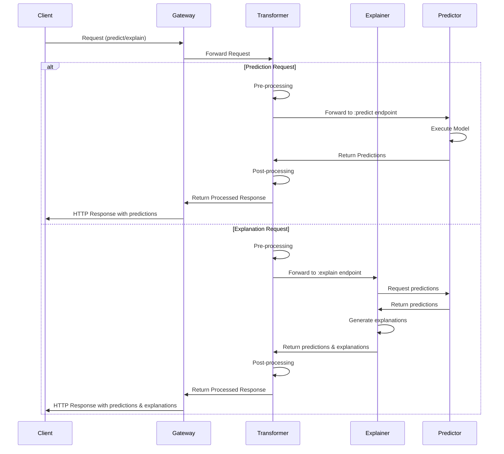

# Data Plane

The KServe data plane is responsible for executing inference requests with high performance and low latency. It handles the actual model serving workloads, including prediction, generation, transformation, and explanation tasks. The data plane is designed to be independent from the control plane, focusing purely on inference execution.

## Overview

The data plane consists of runtime components that serve models and process inference requests. It supports multiple protocols, frameworks, and deployment patterns while maintaining high throughput and low latency characteristics essential for production model serving.

KServe's data plane introduces an inference API that is independent of any specific ML/DL framework and model server. This allows for quick iterations and consistency across Inference Services and supports both easy-to-use and high-performance use cases.

For traditional ML models, KServe offers the V1 and Open Inference Protocol (V2) inference protocols, while for generative AI workloads, it supports the OpenAI-compatible API specification which has become the de facto standard for large language model (LLM) interactions. This enables seamless integration with popular LLM clients and tools while providing streaming capabilities essential for generative AI applications.

By implementing these protocols, both inference clients and servers increase their utility and portability by operating seamlessly on platforms that have standardized around these APIs. KServe's inference protocol is endorsed by NVIDIA Triton Inference Server, TensorFlow Serving and TorchServe.

KServe also supports advanced features like model ensembling, A/B testing by composing multiple InferenceServices together. This allows for complex inference workflows while maintaining a simple and consistent API.

## Architecture

:::note 

This documentation uses tabs to separate information about Generative Inference (for large language models and generative AI) and Predictive Inference (for traditional ML models). Click the tabs above to switch between these different architectures.

:::

import Tabs from '@theme/Tabs';
import TabItem from '@theme/TabItem';

<Tabs groupId="inference-type" defaultValue="generative">
<TabItem value="generative" label="Generative Inference">

### Generative Inference Architecture

The Generative Inference architecture in KServe is specifically designed to handle large language models (LLMs) and other generative AI workloads that require specialized handling for streaming responses, token-by-token generation, and efficient memory management.


#### Key Components

##### Envoy AI Gateway
The top-level gateway that provides:
- **Unified API**: Consistent interface for different model types
- **Usage Tracking**: Monitoring and metering of model usage
- **Intelligent Routing**: Smart request distribution based on model requirements
- **Rate Limiting**: Controls to prevent system overload
- **LLM Observability**: Specialized monitoring for LLM performance

##### Gateway API Inference Extension
Provides enhanced routing capabilities:
- **Endpoint Picker**: Implements intelligent routing based on multiple factors
- **QoS Management**: Quality of service guarantees
- **Load-Aware Routing**: Distributes requests based on current system load
- **Cache-Aware Routing**: Utilizes caching for improved performance

##### Control Plane Components
The left side of the architecture includes key control plane components:
- **KServe Controller**: Manages the lifecycle of inference services
- **KEDA LLM Autoscaler**: Provides autoscaling capabilities specific to LLM workloads
- **Model Cache Controller**: Manages the model caching system
- **GPU Scheduler/DRA**: Handles GPU resource allocation and scheduling

##### Inference Service Deployment
Standard deployment for simpler generative models:
- **vLLM Containers**: Multiple optimized inference containers for LLMs
- **Storage Containers**: Handles model download, storage and retrieval from cache
- **Model Cache / OCI**: Caches models for faster access and reduced latency across nodes. Also supports OCI image formats for model storage.

##### Distributed Inference
For larger models requiring distributed processing:
- **vLLM Head Deployment**: Coordinates inference across worker nodes
- **vLLM Worker Deployment**: Distributed model computation
- **vLLM Prefill Deployment**: Handles initial context processing
- **vLLM Decoding Deployment**: Manages token generation process

##### Infrastructure Components
- **Heterogeneous GPU Farm**: Supports different GPU types (H100, H200, A100, MIG)
- **Distributed KV Cache**: Shared memory system for model key-value pairs
- **Model Registry / Huggingface Hub / GCS / Azure / S3**: Multiple model storage options including cloud storage integrations

### Traffic Flow
There are two main request flows for generative inference: standard inference for simpler models and distributed inference for larger models. Both paths support streaming responses, which is crucial for LLM applications to provide low-latency user experiences.

The following sequence diagram illustrates how requests flow through the KServe generative inference data plane components.



</TabItem>
<TabItem value="predictive" label="Predictive Inference">

### Predictive Inference Architecture

The InferenceService Data Plane architecture for predictive models consists of a static graph of components which coordinate requests for a single model. Advanced features such as Ensembling, A/B testing, and Multi-Arm-Bandits can be achieved by composing InferenceServices together.


Note: Protocol V2 uses /infer instead of :predict

### Data Plane Components

Each endpoint is composed of multiple components: "predictor", "explainer", and "transformer". The only required component is the predictor, which is the core of the system.

#### Predictor
The predictor is the workhorse of the InferenceService and the only required component:
- **Model Serving**: Makes a model available at a network endpoint
- **Model Loading**: Loads models from various storage backends
- **Inference Engine**: Executes prediction/generation requests
- **Protocol Handling**: Supports multiple inference protocols
- **Resource Management**: Manages CPU, memory, and GPU resources

#### Explainer (Optional)
Provides explanations alongside predictions:
- **Model Explanations**: Generates insights into model decisions
- **Framework Integration**: Works with frameworks like TrustyAI, Alibi
- **Prediction Integration**: Connects to the predictor's endpoint 
- **Customization**: Can be configured with environment variables
- **Standardized Interface**: Uses the same API format as prediction with ":explain" verb

#### Transformer (Optional)
Handles pre and post-processing operations:
- **Pre-processing**: Input data transformation and validation
- **Post-processing**: Output formatting and response transformation
- **Feature Engineering**: Real-time feature computation
- **Data Validation**: Input/output schema validation
- **Integration**: Works with tools like Feast for feature transformation

#### Gateway
Manages traffic routing and protocol translation:
- **Request Routing**: Routes requests to appropriate model versions
- **Load Balancing**: Distributes requests across multiple replicas
- **Traffic Splitting**: Enables canary deployments and A/B testing
- **API Translation**: Converts between different protocol versions

### Traffic Flow

The following diagram illustrates how requests flow through the KServe data plane components:



This sequence diagram shows the two main request paths for predictive inference: prediction and explanation. Both paths leverage the transformer for pre and post-processing, but explanation requests include an additional component to generate model explanations.
</TabItem>
</Tabs>

## Data Plane Protocols

<Tabs groupId="inference-type" defaultValue="generative">
<TabItem value="generative" label="Generative Inference">

KServe supports popular API protocols for generative models, primarily based on the OpenAI API specification, which has become a de facto standard for large language model (LLM) inference.

#### OpenAI Compatible APIs

The OpenAI-compatible API endpoints are designed to provide a familiar interface for LLM applications:

| API             | Method | Endpoint             | Description                                                 |
|-----------------|--------|----------------------|-------------------------------------------------------------|
| Chat Completion | POST   | /v1/chat/completions | Generate conversational responses from a given chat history |
| Completion      | POST   | /v1/completions      | Generate text completions for a given prompt                |
| Embeddings      | POST   | /v1/embeddings       | Generate vector embeddings for input text                   |
| Score *         | POST   | /v1/score            | Get the score for a given text                              |

*Note: The Score API is not part of the OpenAI specification but is included for compatibility with KServe's generative inference capabilities.

#### Streaming Support

Generative inference protocols support streaming responses, which is crucial for LLM applications:

- **Server-Sent Events (SSE)**: Used for token-by-token streaming
- **Chunk-Based Responses**: Partial responses sent as they're generated
- **Early Termination**: Ability to cancel ongoing generations

#### Chat Completion API Example

```json
// Request
POST /v1/chat/completions
{
  "model": "gpt-4",
  "messages": [
    {"role": "system", "content": "You are a helpful assistant."},
    {"role": "user", "content": "Hello, can you help me with KServe?"}
  ],
  "temperature": 0.7,
  "max_tokens": 150,
  "stream": true
}

// Response (non-streaming)
{
  "id": "cmpl-123abc",
  "object": "chat.completion",
  "created": 1694268762,
  "model": "gpt-4",
  "choices": [
    {
      "index": 0,
      "message": {
        "role": "assistant",
        "content": "Yes, I'd be happy to help you with KServe! KServe is a serverless framework for serving machine learning models on Kubernetes..."
      },
      "finish_reason": "stop"
    }
  ],
  "usage": {
    "prompt_tokens": 18,
    "completion_tokens": 33,
    "total_tokens": 51
  }
}
```

#### Embedding API Example

```json
// Request
POST /v1/embeddings
{
  "model": "text-embedding-ada-002",
  "input": "The food was delicious and the service was excellent."
}

// Response
{
  "object": "list",
  "data": [
    {
      "object": "embedding",
      "embedding": [0.0023064255, -0.009327292, ...],
      "index": 0
    }
  ],
  "model": "text-embedding-ada-002",
  "usage": {
    "prompt_tokens": 8,
    "total_tokens": 8
  }
}
```

#### Key Features of Generative Inference Protocol

- **Parameter Control**: Fine-tuning of generation parameters (temperature, top-p, etc.)
- **Streaming**: Token-by-token response streaming
- **Function Calling**: Structured outputs and function invocation
- **System Instructions**: Ability to set behavior constraints
- **Token Management**: Tracking token usage for quota/billing

</TabItem>
<TabItem value="predictive" label="Predictive Inference">

KServe supports two versions of its data plane for predictive models: V1 and V2 (Open Inference Protocol). V1 protocol offers a standard prediction workflow with HTTP/REST. The V2 protocol addresses performance and generality concerns across many model frameworks and servers, and includes gRPC support.

#### Main Differences Between V1 and V2

* V2 does not currently support the explain endpoint (available in V1)
* V2 adds Server Readiness/Liveness/Metadata endpoints
* V2 endpoint paths use `/` instead of `:`
* V2 renamed `:predict` endpoint to `/infer`
* V2 allows for model versions in the request path (optional)

> **Note**: Detailed API references for the protocols are available in the [V1 Protocol](./v1_protocol.md) and [V2 Protocol](./v2_protocol.md) documentation.


### V1 Protocol Details
KServe's V1 protocol offers a standardized prediction workflow across all model frameworks. This protocol provides an explain functionality and flexible schema options that can be suitable for various use cases.

#### API Definitions

| API         | Definition                                                                                                                                                                                                                       |
|-------------|----------------------------------------------------------------------------------------------------------------------------------------------------------------------------------------------------------------------------------|
| Predict     | The "predict" API performs inference on a model. The response is the prediction result. All InferenceServices speak the [Tensorflow V1 HTTP API](https://www.tensorflow.org/tfx/serving/api_rest#predict_api).                   |
| Explain     | The "explain" API is an optional component that provides model explanations in addition to predictions. The standardized explainer interface is identical to the Tensorflow V1 HTTP API with the addition of an ":explain" verb. |
| Model Ready | The "model ready" health API indicates if a specific model is ready for inferencing. If the model(s) is downloaded and ready to serve requests, the model ready endpoint returns the list of accessible &lt;model_name&gt;(s).   |
| List Models | The "models" API exposes a list of models in the model registry.                                                                                                                                                                 |

#### Request and Response Payloads

| API         | Request Payload       | Response Payload                              |
|-------------|-----------------------|-----------------------------------------------|
| List Models |                       | `{"models": [<model_name>]}`                  |
| Model Ready |                       | `{"name": &lt;model_name&gt;,"ready": $bool}` |
| Predict     | `{"instances": []} *` | `{"predictions": []}`                         |
| Explain     | `{"instances": []} *` | `{"predictions": [], "explanations": []}`     |

*Note: Payload is optional.

### Open Inference Protocol (V2 Protocol)
For an inference server to be compliant with the V2 protocol, it must implement the health, metadata, and inference V2 APIs. A compliant server may implement the HTTP/REST API and/or the gRPC API.

The Open Inference Protocol includes comprehensive support for:
- **Standardized Interface**: Industry-standard inference protocol
- **OpenAPI Specification**: Well-defined API schemas
- **Multi-framework Support**: Works across different ML frameworks
- **Metadata Support**: Rich model and version metadata
- **Health Checking**: Standardized health and status endpoints
- **REST and gRPC**: Supports both RESTful HTTP and gRPC protocols
- **Binary Protocol**: High-performance binary communication
- **Health Endpoints**: Readiness and liveness probes
- **Server Metadata**: Detailed server information and capabilities
- **Data Type Support**: Support for various data types and tensor formats.

#### Binary Tensor Data Extension
The Binary Tensor Data Extension allows clients to send and receive tensor data in a binary format in the body of an HTTP/REST request. This extension is particularly useful for:

- Sending and receiving FP16 data
- Handling large tensors for high-throughput scenarios
- Improving performance for data-intensive applications

Binary data is organized in little-endian byte order, row major, without stride or padding between elements. When binary data is used, special parameters indicate the data format and size:

- `binary_data_size`: Indicates the size of tensor binary data in bytes
- `binary_data`: Boolean flag to request output as binary data
- `binary_data_output`: Boolean flag to request all outputs in binary format

#### gRPC Implementation
The gRPC implementation offers a high-performance alternative with strong typing and efficient binary communication. It includes the same functional endpoints as the REST API but with the performance advantages of gRPC.

</TabItem>
</Tabs>


## Next Steps

### For Generative Inference
- Learn about vLLM integration for efficient LLM serving
- Understand model sharding and distribution for large language models
- Explore streaming APIs for token-by-token generation
- Implement caching strategies for improved LLM performance

### For Predictive Inference
- Review [V1 Protocol](./v1_protocol.md) and [Open Inference Protocol / V2 Protocol](./v2_protocol.md) documentation for detailed API specifications
- Check out the [Binary Tensor Data Extension for Open Inference Protocol](./binary_tensor_data_extension.md) for high-performance tensor handling.

### General Resources
- Explore [Control Plane](../control_plane.md) to understand service management
- Learn about [Resources](../../resources/) to understand KServe custom resources
