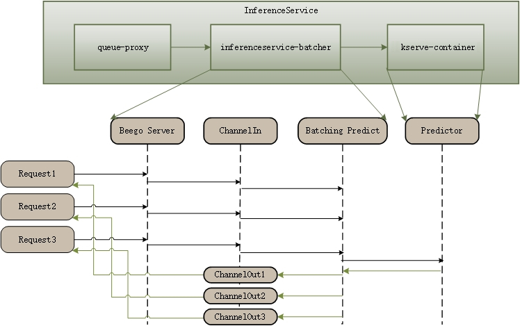

# Inference Batcher

This docs explains on how batch prediction for any ML frameworks (TensorFlow, PyTorch, ...) without decreasing the performance.

This batcher is implemented in the KServe model agent sidecar, so the requests first hit the agent sidecar, when a batch prediction is triggered the request is then sent to the model server container for inference.



* We use webhook to inject the model agent container in the InferenceService pod to do the batching when batcher is enabled.

* We use go channels to transfer data between http request handler and batcher go routines.

* Currently we only implemented batching with KServe v1 HTTP protocol, gRPC is not supported yet.

* When the number of instances (For example, the number of pictures) reaches the ```maxBatchSize``` or the latency meets the ```maxLatency```, a batch prediction will be triggered.


### Example

We first create a pytorch predictor with a batcher. The `maxLatency` is set to a big value (500 milliseconds) to make us be able to observe the batching process.

=== "New Schema"

    ```yaml
    apiVersion: serving.kserve.io/v1beta1
    kind: InferenceService
    metadata:
      name: "torchserve"
    spec:
      predictor:
        minReplicas: 1
        timeout: 60
        batcher:
          maxBatchSize: 32
          maxLatency: 500
        model:
          modelFormat:
            name: pytorch
          storageUri: gs://kfserving-examples/models/torchserve/image_classifier/v1
    ```

=== "Old Schema"

    ```yaml
    apiVersion: serving.kserve.io/v1beta1
    kind: InferenceService
    metadata:
      name: "torchserve"
    spec:
      predictor:
        minReplicas: 1
        timeout: 60
        batcher:
          maxBatchSize: 32
          maxLatency: 500
        pytorch:
          storageUri: gs://kfserving-examples/models/torchserve/image_classifier/v1
    ```

* `maxBatchSize`: the max batch size for triggering a prediction.

* `maxLatency`: the max latency for triggering a prediction (In milliseconds).

* `timeout`: timeout of calling predictor service (In seconds).

All of the bellowing fields have default values in the code. You can config them or not as you wish.

* `maxBatchSize`: 32.

* `maxLatency`: 500.

* `timeout`: 60.

=== "kubectl"
```bash
kubectl create -f pytorch-batcher.yaml
```

We can now send requests to the pytorch model using hey.
The first step is to [determine the ingress IP and ports](../../get_started/first_isvc.md#4-determine-the-ingress-ip-and-ports) and set `INGRESS_HOST` and `INGRESS_PORT`

```bash
MODEL_NAME=mnist
INPUT_PATH=@./input.json
SERVICE_HOSTNAME=$(kubectl get inferenceservice torchserve -o jsonpath='{.status.url}' | cut -d "/" -f 3)

hey -z 10s -c 5 -m POST -host "${SERVICE_HOSTNAME}" -H "Content-Type: application/json" -D ./input.json "http://${INGRESS_HOST}:${INGRESS_PORT}/v1/models/$MODEL_NAME:predict"
```

The request will go to the model agent container first, the batcher in sidecar container batches the requests and send the inference request to the predictor container.

!!! note
    If the interval of sending the two requests is less than `maxLatency`, the returned `batchId` will be the same.


!!! success "Expected Output"

    ```{ .bash .no-copy }
    Summary:
      Total:	10.5361 secs
      Slowest:	0.5759 secs
      Fastest:	0.4983 secs
      Average:	0.5265 secs
      Requests/sec:	9.4912
      
      Total data:	24100 bytes
      Size/request:	241 bytes
    
    Response time histogram:
      0.498 [1]	|■
      0.506 [0]	|
      0.514 [44]	|■■■■■■■■■■■■■■■■■■■■■■■■■■■■■■■■■■■■■■■■
      0.522 [21]	|■■■■■■■■■■■■■■■■■■■
      0.529 [4]	|■■■■
      0.537 [5]	|■■■■■
      0.545 [4]	|■■■■
      0.553 [0]	|
      0.560 [7]	|■■■■■■
      0.568 [4]	|■■■■
      0.576 [10]	|■■■■■■■■■
    
    
    Latency distribution:
      10% in 0.5100 secs
      25% in 0.5118 secs
      50% in 0.5149 secs
      75% in 0.5406 secs
      90% in 0.5706 secs
      95% in 0.5733 secs
      99% in 0.5759 secs
    
    Details (average, fastest, slowest):
      DNS+dialup:	0.0004 secs, 0.4983 secs, 0.5759 secs
      DNS-lookup:	0.0001 secs, 0.0000 secs, 0.0015 secs
      req write:	0.0002 secs, 0.0000 secs, 0.0076 secs
      resp wait:	0.5257 secs, 0.4981 secs, 0.5749 secs
      resp read:	0.0001 secs, 0.0000 secs, 0.0009 secs
    
    Status code distribution:
      [200]	100 responses
    ```
